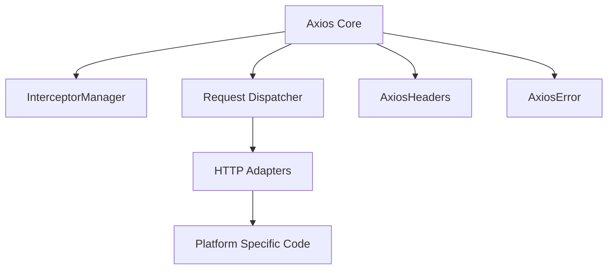
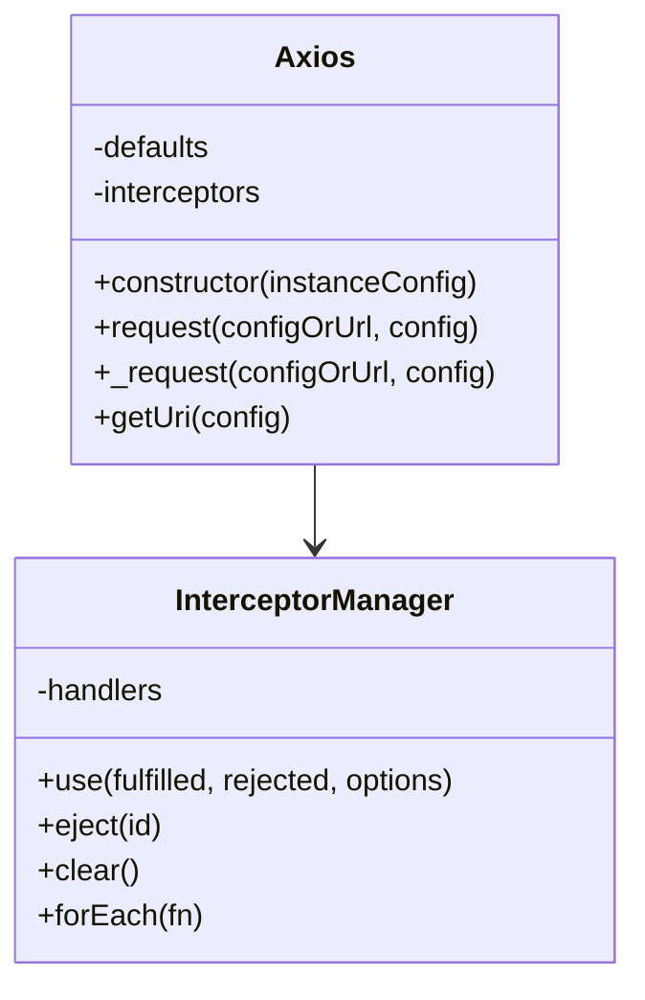

```markdown
# Architectural Overview of Axios Codebase

## Executive Summary

Axios is a promise-based HTTP client library designed for both browser and Node.js environments. The codebase exhibits a modular, layered architecture centered around a core Axios class that manages HTTP request configuration, dispatch, and response handling. Key architectural patterns include the use of interceptors for request/response processing, a pluggable adapter system for environment-specific HTTP transport, and a clear separation of concerns between configuration, request dispatch, and error handling.

The core Axios class encapsulates request lifecycle management, including configuration merging, interceptor execution, and dispatching requests via adapters. The codebase emphasizes extensibility and modularity, with components such as `InterceptorManager`, `AxiosHeaders`, and error classes like `AxiosError` providing specialized functionality. The architecture supports asynchronous operations with Promises and async/await, and includes robust error handling and cancellation mechanisms.

Testing and build configurations are comprehensive, supporting multiple environments and ensuring code quality. The package.json reveals a modern JavaScript/TypeScript stack with extensive use of tooling for linting, testing, and building. Overall, the architecture is designed for flexibility, extensibility, and cross-platform compatibility, making Axios a widely used HTTP client library.

---

## 1. High-Level Architecture

### Architectural Pattern

- **Layered Architecture**: The codebase is organized into distinct layers:
  - **Core Layer**: Contains the main Axios class (`lib/core/Axios.js`), interceptors (`InterceptorManager.js`), request dispatch (`dispatchRequest.js`), and error handling (`AxiosError.js`).
  - **Helpers Layer**: Utility functions for URL building, validation, and header parsing.
  - **Adapters Layer**: Environment-specific HTTP adapters (e.g., XHR for browsers, HTTP for Node.js).
  - **Platform Layer**: Platform-specific utilities and classes.
- **Modular Design**: Each component/module has a single responsibility, promoting separation of concerns.
- **Interceptor Pattern**: Request and response interceptors allow middleware-like processing of HTTP requests and responses.
- **Promise-based Asynchronous Pattern**: All HTTP operations return Promises, supporting async/await.

### Mermaid Component Diagram



### Key Design Principles

- **Separation of Concerns**: Clear division between configuration, request dispatch, interceptors, and error handling.
- **Modularity**: Components like interceptors, adapters, and headers are encapsulated and reusable.
- **Extensibility**: Interceptors and adapters can be extended or replaced to customize behavior.
- **Asynchronous Handling**: Use of Promises and async/await for non-blocking HTTP requests.
- **Robust Error Handling**: Custom error class with rich metadata and stack trace management.

---

## 2. Component Structure

### Core Components and Responsibilities

- **Axios (lib/core/Axios.js)**: Central class managing HTTP request lifecycle, configuration merging, interceptor execution, and request dispatch.
- **InterceptorManager (lib/core/InterceptorManager.js)**: Manages registration, execution, and removal of request/response interceptors.
- **dispatchRequest (lib/core/dispatchRequest.js)**: Executes the HTTP request using the selected adapter, handles cancellation, and transforms request/response data.
- **AxiosHeaders (lib/core/AxiosHeaders.js)**: Encapsulates HTTP header manipulation with case-insensitive keys and utility methods.
- **AxiosError (lib/core/AxiosError.js)**: Custom error class for HTTP errors with extended properties and error codes.

### Mermaid Class Diagram for Axios and InterceptorManager



### Dependencies and Circular Dependencies

- **Dependencies**:
  - Axios depends on InterceptorManager, AxiosHeaders, dispatchRequest, and utility helpers.
  - dispatchRequest depends on adapters and AxiosHeaders.
  - InterceptorManager is standalone managing interceptor handlers.
- **Circular Dependencies**: None detected in the core modules analyzed.

---

## 3. Data Flow

### Primary Data Flow (Request Lifecycle)

1. User calls `axios.request()` or alias method (e.g., `axios.get()`).
2. Axios merges user config with defaults.
3. Request interceptors are executed in order.
4. Request is dispatched via `dispatchRequest` using the selected adapter.
5. Adapter sends HTTP request and returns a Promise.
6. Response interceptors are executed in order.
7. Final response or error is returned to the caller.

### Mermaid Sequence Diagram (Simplified)

```mermaid
graph TD
    User[User Code] --> Axios[Axios.request()]
    Axios --> InterceptorsReq[Request Interceptors]
    InterceptorsReq --> Dispatch[dispatchRequest()]
    Dispatch --> Adapter[HTTP Adapter]
    Adapter --> Dispatch
    Dispatch --> InterceptorsRes[Response Interceptors]
    InterceptorsRes --> User
```

### Key Data Structures / Models

- **Config Object**: Contains request parameters, headers, method, URL, timeout, etc.
- **Response Object**: Contains `data`, `status`, `statusText`, `headers`, `config`, and `request`.
- **AxiosHeaders**: Encapsulates HTTP headers as a case-insensitive map.
- **AxiosError**: Error object with message, code, config, request, response, and stack trace.

### API Contracts

- **Public API**: `axios(config)`, `axios.get(url[, config])`, `axios.post(url, data[, config])`, etc.
- **Interceptor API**: `interceptors.request.use(fulfilled, rejected, options)`, `interceptors.response.use(fulfilled, rejected)`.
- **Adapter API**: Adapters are functions accepting a config and returning a Promise resolving to a response.

---

## 4. State Management

- **State Management Approach**: Stateless HTTP client; state is managed per request via config objects.
- **Interceptors**: Maintain internal state of registered handlers in `InterceptorManager`.
- **No Global or Persistent State**: No Redux, React state, or server-side sessions.
- **Cancellation Tokens and Signals**: Support for AbortController and CancelToken for request cancellation.

---

## 5. Error Handling & Resilience

- **Error Handling Strategy**:
  - Custom `AxiosError` class encapsulates error details.
  - Errors thrown on HTTP status codes outside 2xx by default.
  - Errors include stack traces, HTTP status, config, request, and response.
- **Resilience Patterns**:
  - Cancellation support via `CancelToken` (deprecated) and `AbortController`.
  - No explicit retry or circuit breaker patterns found in core code.
- **Exception Hierarchy**:
  - `AxiosError` extends native `Error`.
  - Specific error codes defined as static properties on `AxiosError` (e.g., `ERR_BAD_OPTION`, `ECONNABORTED`).

---

## 6. Security Model

- **Authentication/Authorization**:
  - Supports HTTP Basic Auth via config `auth` object.
  - Authorization headers can be set manually.
- **Data Protection**:
  - Supports XSRF protection via configurable cookie and header names.
- **Encryption**:
  - No encryption implemented internally; relies on HTTPS transport.
- **Potential Security Concerns**:
  - None evident in code; security depends on usage and transport layer.

---

## 7. Performance Considerations

- **Caching**: No caching mechanisms implemented internally.
- **Concurrency/Parallelism**:
  - Uses Promises and async/await for asynchronous request handling.
  - Supports concurrent requests via `Promise.all`.
- **Optimizations**:
  - Interceptors can be synchronous or asynchronous to optimize request flow.
  - Headers are normalized and cached in `AxiosHeaders`.
  - Rate limiting options available for Node.js HTTP adapter.

---

## 8. Testing Strategy

- **Testing Frameworks**:
  - Uses Mocha for unit and integration tests.
  - Karma for browser testing.
  - ESLint for linting.
- **Test Types**:
  - Unit tests for core modules (Axios, interceptors, adapters).
  - Spec tests for features like cancellation, headers, transforms.
- **Test Coverage**:
  - Coverage badges and config present, but no explicit coverage reports found in codebase.
- **Test Files**:
  - Located under `test/specs/` and `test/unit/`.

---

## 9. Deployment Architecture

- **Deployment Model**:
  - Library distributed as npm package.
  - Supports multiple module formats: ESM, CommonJS.
  - Bundled for browser and Node.js environments.
- **Build Tools**:
  - Uses Rollup and Webpack for bundling.
  - Gulp for task automation.
- **CI/CD**:
  - GitHub Actions workflow referenced in README badges.
  - Release automation via `release-it` configured in package.json.
- **Mermaid Deployment Diagram**: Information not available in the provided codebase (no explicit deployment config files).

---

## 10. Technology Stack

- **Languages**: JavaScript (ES6+), TypeScript typings included.
- **Build Tools**: Rollup, Webpack, Gulp.
- **Testing**: Mocha, Karma, ESLint.
- **Dependencies**:
  - `follow-redirects` for HTTP redirects.
  - `form-data` for Node.js multipart form support.
  - `proxy-from-env` for proxy environment variable support.
- **Dev Dependencies**:
  - Babel, TypeScript, Husky, Commitlint, Release-it, Sinon, etc.
- **Version**: Axios version 1.9.0 as per package.json.
- **No deprecated dependencies** explicitly found in package.json.

---

## Key Architectural Decisions

- **Interceptor Pattern**: Enables flexible middleware for request/response processing.
- **Adapter Abstraction**: Allows Axios to work seamlessly across browser and Node.js environments.
- **Promise-based API**: Modern async handling with support for async/await.
- **Custom Headers Class**: `AxiosHeaders` provides robust header management beyond plain objects.
- **Error Handling**: Rich error objects with extended metadata improve debugging and error management.
- **Cancellation Support**: Dual support for AbortController and legacy CancelToken for request cancellation.
- **Modular and Extensible**: Clear separation of concerns facilitates maintenance and extension.

---

## Recommendations

- **Add Built-in Retry Mechanism**: Implement configurable retry logic for transient network errors to improve resilience.
- **Introduce Caching Layer**: Optional caching of GET requests could improve performance for repeated requests.
- **Expand Security Features**: Add built-in support for OAuth or token refresh mechanisms.
- **Improve Documentation on Deployment**: Include deployment and CI/CD configuration files for better transparency.
- **Enhance TypeScript Support**: Provide full TypeScript source or better typings for improved developer experience.
- **Add Performance Metrics**: Integrate hooks or events for monitoring request performance and failures.

---

# End of Architectural Overview
```