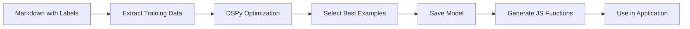

# Quick Actions Label Generator

A DSPy-powered system for automatically generating concise labels from section headings, replacing manual metadata annotations in markdown documents.

## 🎯 Goal

The goal of this project was to eliminate the "metadata hack" of using parentheses in markdown headings to specify quick action labels:

```markdown
# OLD WAY (metadata hack)
## Introduction to Machine Learning (ML Intro)
## Frequently Asked Questions (FAQ)

# NEW WAY (automatic generation)
## Introduction to Machine Learning  → "ML Intro"
## Frequently Asked Questions      → "FAQ"
```

## 📊 Outcomes

1. **Trained DSPy Model**: Optimized few-shot model that generates consistent, concise labels
2. **JavaScript Integration**: Two approaches for using the model in JavaScript applications
3. **Automated Pipeline**: Single script that handles the entire training and generation process
4. **High Accuracy**: The model generates appropriate 1-3 word labels for diverse headings

## 🚀 Usage

### Prerequisites

```bash
# Set your OpenAI API key
export OPENAI_API_KEY="your-key-here"

# Install dependencies (one time)
uv sync
```

### Generate Labels for Your Document

```bash
# Run the complete pipeline
./generate_optimised_quick_action_prompt.sh path/to/your-document.md
```

This generates:
- `output/your-document.prompt.txt` - Optimized prompt for LLM use
- `output/optimized_label_generator.json` - Trained DSPy model
- `output/generateQuickActionLabel.js` - Simple JavaScript function
- `output/generateQuickActionLabelDSPy.js` - DSPy-formatted JavaScript function

### Use in JavaScript

```javascript
// Option 1: Simple pattern-based function (no API calls)
import { generateQuickActionLabel } from './output/generateQuickActionLabel.js';

const label = generateQuickActionLabel("Introduction to Machine Learning");
// Returns: "Introduction"

// Option 2: LLM-powered function with DSPy format
import { generateQuickActionLabelDSPy } from './output/generateQuickActionLabelDSPy.js';
import OpenAI from 'openai';

const openai = new OpenAI({ apiKey: process.env.OPENAI_API_KEY });
const label = await generateQuickActionLabelDSPy("Advanced Topics", openai);
// Returns: "Advanced Topics"
```

### Test the Model

```bash
# Test on sample headings
uv run python test_labeler.py
```

---

## 📚 How DSPy Works (Sidebar)

### What is DSPy?

DSPy (Declarative Self-improving Language Programs) is a framework that optimizes prompts and few-shot examples automatically, rather than requiring manual prompt engineering.

### The DSPy Training Process

1. **Define the Task**: We specify a signature that describes inputs and outputs:
   ```python
   class GenerateLabel(dspy.Signature):
       """Generate a short label for a section heading"""
       heading: str = dspy.InputField()
       label: str = dspy.OutputField()
   ```

2. **Provide Training Data**: We give examples of headings with their desired labels:
   ```json
   {
     "heading": "Frequently Asked Questions",
     "label": "FAQ"
   }
   ```

3. **Optimization**: DSPy uses `BootstrapFewShot` to:
   - Try different combinations of examples
   - Test which examples work best as few-shot demonstrations
   - Select the optimal subset (in our case, 4 examples)

4. **Model Generation**: The output is a JSON file containing:
   ```json
   {
     "demos": [/* optimized few-shot examples */],
     "signature": {/* task definition */}
   }
   ```

### Why Not Use DSPy Directly in JavaScript?

DSPy is a Python framework that requires:
- Python runtime for model execution
- DSPy's optimization and compilation features
- Direct integration with language models

Since we can't run DSPy in JavaScript, we:

1. **Extract the Optimized Prompt**: We capture the exact prompt structure DSPy creates, including:
   - System instructions with structured format
   - The optimized few-shot examples
   - The specific response format

2. **Generate JavaScript Functions**: We create two approaches:
   - **Simple function**: Uses pattern matching based on training data
   - **DSPy-formatted function**: Replicates DSPy's exact prompt structure for LLM calls

3. **Preserve DSPy's Benefits**: Even though we can't use DSPy directly, we benefit from:
   - Optimized example selection
   - Consistent prompt structure
   - Chain-of-thought reasoning format

### The Training Pipeline



The key insight is that DSPy's value comes from its optimization process. Once we have the optimized prompt and examples, we can use them in any language by replicating the prompt structure.

---

## 📁 Project Structure

```
quick-actions/
├── generate_optimised_quick_action_prompt.sh  # Main pipeline script
├── extract_labels.py                          # Extract training data
├── train_labeler.py                           # Train DSPy model
├── test_labeler.py                            # Test the model
├── extract_prompt.py                          # Generate simple JS
├── extract_exact_prompt.py                    # Generate DSPy JS
└── output/                                    # Generated files
    ├── optimized_label_generator.json         # DSPy model
    ├── *.prompt.txt                           # Optimized prompts
    └── *.js                                   # JavaScript functions
```

## 🔧 Requirements

- Python 3.8+
- OpenAI API key
- uv (Python package manager)

## 📝 Training Data Format

Your markdown must include parenthetical labels for training:

```markdown
# Section Title (Short Label)
## Another Section (Label)
```

The system requires at least a few examples to train effectively.