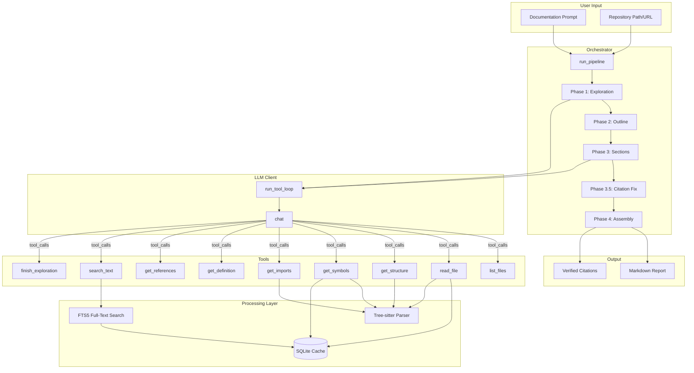
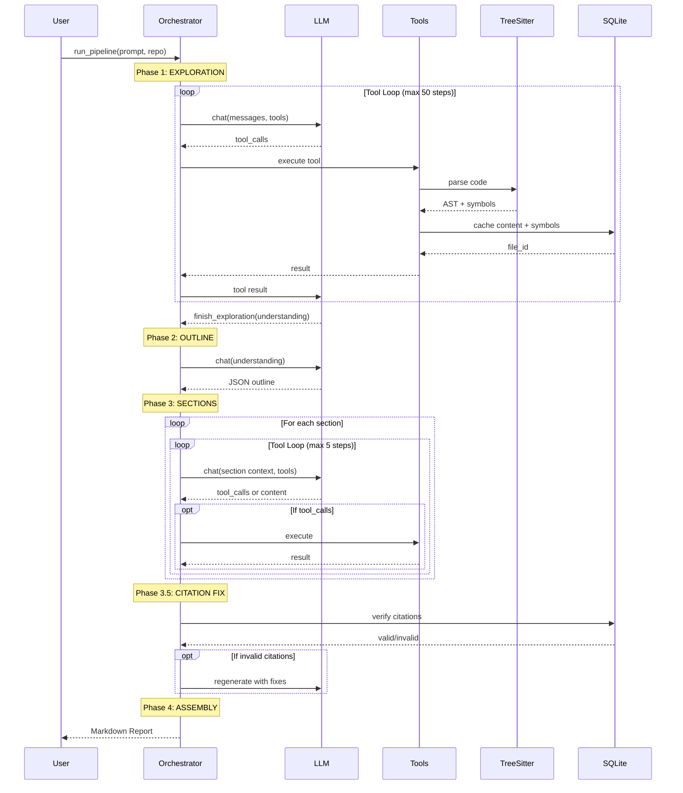
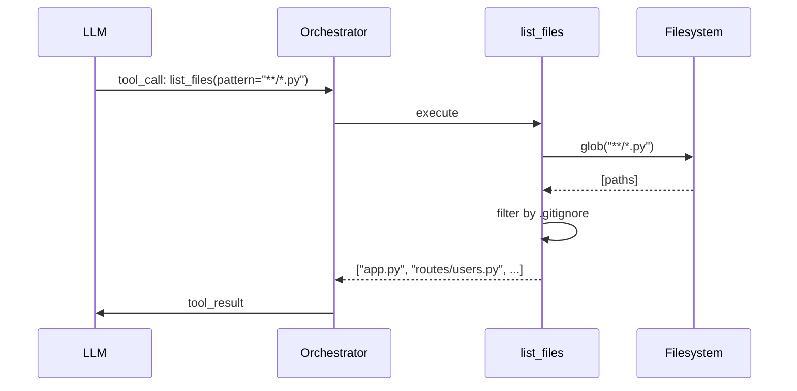
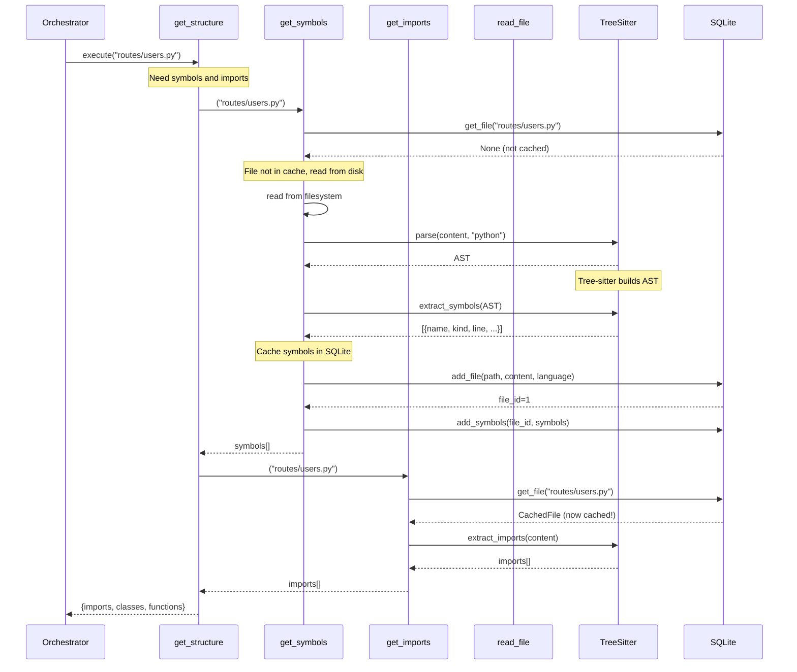
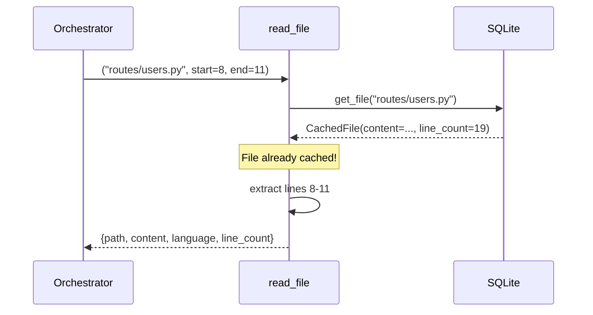
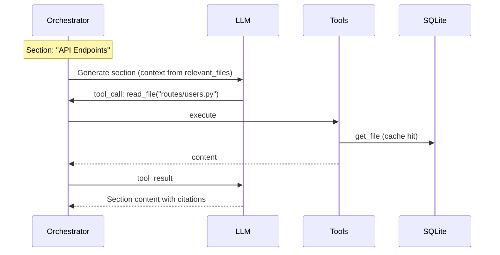
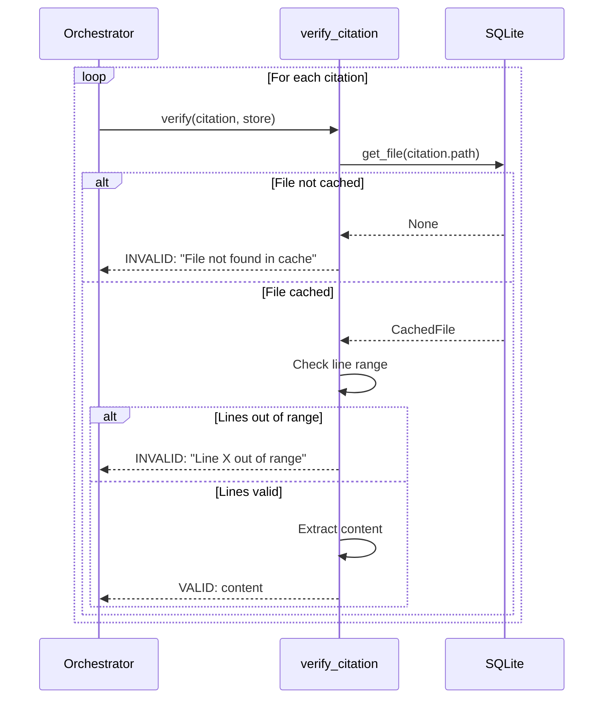
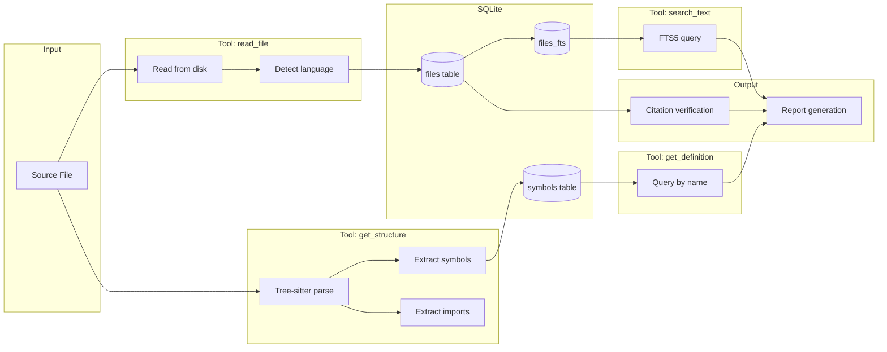

# Tech Writer: End-to-End Worked Example

This document walks through a complete example of how tech_writer generates documentation, showing how tool calling triggers tree-sitter parsing, SQLite storage, and citation verification.

## Big Picture: System Architecture



## Big Picture: Sequence of Phases



## Worked Example: Documenting a Flask App

Let's trace through a real example documenting a simple Flask application.

### Input

```
Prompt: "Document the API endpoints in this Flask application."
Repository: tests/fixtures/sample_flask_app/
```

The repository structure:
```
sample_flask_app/
├── app.py
├── routes/
│   ├── __init__.py
│   ├── users.py
│   └── health.py
└── models/
    ├── __init__.py
    └── user.py
```

---

## Phase 1: Exploration Deep Dive

### Step 0: LLM Initiates Exploration

The LLM receives the system prompt and user request, then decides to explore:

```json
// LLM Response
{
  "tool_calls": [
    {
      "id": "call_001",
      "name": "list_files",
      "arguments": {"pattern": "**/*.py"}
    }
  ]
}
```

### Step 0 Tool Execution: list_files



**Result:**
```json
["app.py", "models/__init__.py", "models/user.py", "routes/__init__.py", "routes/health.py", "routes/users.py"]
```

### Step 1: LLM Requests Structure Analysis

```json
{
  "tool_calls": [
    {"id": "call_002", "name": "get_structure", "arguments": {"path": "app.py"}},
    {"id": "call_003", "name": "get_structure", "arguments": {"path": "routes/users.py"}}
  ]
}
```

### Step 1 Tool Execution: get_structure

This is where tree-sitter and SQLite integration happens. Let's trace `get_structure("routes/users.py")`:



### Tree-sitter Parsing Example

Given this source file (`routes/users.py`):

```python
"""User routes for the API."""

from flask import Blueprint, jsonify, request
from models.user import User

users_bp = Blueprint('users', __name__)

@users_bp.route('/users', methods=['GET'])
def list_users():
    """List all users."""
    return jsonify([u.to_dict() for u in User.all()])

@users_bp.route('/users/<int:user_id>', methods=['GET'])
def get_user(user_id):
    """Get a user by ID."""
    user = User.find(user_id)
    if user:
        return jsonify(user.to_dict())
    return jsonify({"error": "Not found"}), 404
```

**Tree-sitter parses this into an AST:**

```
module [0:0 - 19:0]
├── expression_statement [0:0 - 0:31]  # docstring
├── import_from_statement [2:0 - 2:47]
│   └── dotted_name: "flask"
│   └── names: ["Blueprint", "jsonify", "request"]
├── import_from_statement [3:0 - 3:28]
│   └── dotted_name: "models.user"
│   └── names: ["User"]
├── assignment [5:0 - 5:40]  # users_bp = Blueprint(...)
├── decorated_definition [7:0 - 11:55]
│   ├── decorator
│   └── function_definition
│       └── name: "list_users"
│       └── body [9:0 - 11:55]
├── decorated_definition [13:0 - 19:47]
│   ├── decorator
│   └── function_definition
│       └── name: "get_user"
│       └── body [16:0 - 19:47]
```

**Extracted symbols:**

```json
[
  {"name": "list_users", "kind": "function", "line": 8, "end_line": 11,
   "signature": "def list_users():", "doc": "List all users."},
  {"name": "get_user", "kind": "function", "line": 14, "end_line": 19,
   "signature": "def get_user(user_id):", "doc": "Get a user by ID."}
]
```

**Extracted imports:**

```json
[
  {"module": "flask", "names": ["Blueprint", "jsonify", "request"], "line": 3, "is_relative": false},
  {"module": "models.user", "names": ["User"], "line": 4, "is_relative": false}
]
```

### SQLite Storage

After parsing, data is stored in SQLite:

**files table:**
| id | path | content | lang | line_count | hash | cached_at |
|----|------|---------|------|------------|------|-----------|
| 1 | routes/users.py | `"""User routes..."""` | python | 19 | a1b2c3d4 | 2024-01-15T10:30:00 |
| 2 | app.py | `"""Flask app..."""` | python | 25 | e5f6g7h8 | 2024-01-15T10:30:01 |

**symbols table:**
| id | file_id | name | kind | line | end_line | signature | doc |
|----|---------|------|------|------|----------|-----------|-----|
| 1 | 1 | list_users | function | 8 | 11 | `def list_users():` | List all users. |
| 2 | 1 | get_user | function | 14 | 19 | `def get_user(user_id):` | Get a user by ID. |

**files_fts table (FTS5 virtual table):**
Automatically populated via triggers for full-text search.

### Step 1 Tool Result

```json
{
  "imports": [
    {"module": "flask", "names": ["Blueprint", "jsonify", "request"], "line": 3},
    {"module": "models.user", "names": ["User"], "line": 4}
  ],
  "classes": [],
  "functions": [
    {"name": "list_users", "line": 8, "end_line": 11, "signature": "def list_users():"},
    {"name": "get_user", "line": 14, "end_line": 19, "signature": "def get_user(user_id):"}
  ]
}
```

### Step 2: LLM Reads Specific Code

Now the LLM wants to see actual implementation:

```json
{
  "tool_calls": [
    {"id": "call_004", "name": "read_file",
     "arguments": {"path": "routes/users.py", "start_line": 8, "end_line": 11}}
  ]
}
```

### Step 2 Tool Execution: read_file (Cache Hit)



**Result:**
```json
{
  "path": "routes/users.py",
  "content": "@users_bp.route('/users', methods=['GET'])\ndef list_users():\n    \"\"\"List all users.\"\"\"\n    return jsonify([u.to_dict() for u in User.all()])",
  "language": "python",
  "line_count": 19
}
```

### Steps 3-N: Continued Exploration

The LLM continues exploring, calling various tools. Each call potentially:
1. **Reads files** → cached in SQLite
2. **Parses with tree-sitter** → extracts symbols/imports
3. **Stores metadata** → enables cross-file queries

### Final Step: finish_exploration

```json
{
  "tool_calls": [
    {"id": "call_010", "name": "finish_exploration",
     "arguments": {
       "understanding": "This Flask app has:\n- Main app in app.py\n- User routes in routes/users.py with GET /users and GET /users/<id>\n- Health endpoint in routes/health.py\n- User model in models/user.py\n\nKey patterns:\n- Blueprint-based route organization\n- JSON API responses\n- Model layer abstraction"
     }}
  ]
}
```

---

## Phase 2: Outline Generation

The orchestrator sends the understanding to generate an outline:

```json
// LLM Response
[
  {"title": "Overview", "focus": "Application structure and setup", "relevant_files": ["app.py"]},
  {"title": "API Endpoints", "focus": "Available routes and their behavior", "relevant_files": ["routes/users.py", "routes/health.py"]},
  {"title": "Data Models", "focus": "User model structure", "relevant_files": ["models/user.py"]}
]
```

---

## Phase 3: Section Generation

For each section, the LLM can make additional tool calls:



**Generated Section:**
```markdown
## API Endpoints

The application exposes REST endpoints through Flask Blueprints.

### User Endpoints

The `list_users` function handles GET requests to `/users` [routes/users.py:8-11]:

```python
@users_bp.route('/users', methods=['GET'])
def list_users():
    """List all users."""
    return jsonify([u.to_dict() for u in User.all()])
```

Individual users can be fetched via `get_user` [routes/users.py:14-19].
```

---

## Phase 3.5: Citation Verification

### Citation Extraction

The `extract_citations` function finds all `[path:line-line]` patterns:

```python
# Input markdown
markdown = """
The `list_users` function handles GET requests [routes/users.py:8-11].
Individual users can be fetched via `get_user` [routes/users.py:14-19].
See also the health check [routes/health.py:5-10].
"""

# Extracted citations
citations = [
    Citation(path="routes/users.py", start_line=8, end_line=11),
    Citation(path="routes/users.py", start_line=14, end_line=19),
    Citation(path="routes/health.py", start_line=5, end_line=10),
]
```

### Citation Verification Flow



### Verification Results

```python
# Hypothetical results
results = [
    VerificationResult(
        citation=Citation("routes/users.py", 8, 11),
        valid=True,
        content="@users_bp.route('/users', methods=['GET'])\ndef list_users():..."
    ),
    VerificationResult(
        citation=Citation("routes/users.py", 14, 19),
        valid=True,
        content="@users_bp.route('/users/<int:user_id>'..."
    ),
    VerificationResult(
        citation=Citation("routes/health.py", 5, 10),
        valid=False,
        error="File not found in cache: routes/health.py"  # wasn't read during exploration
    ),
]

# Summary: 2 valid, 1 invalid
```

### Invalid Citation Handling

If citations are invalid, the section is regenerated with explicit instructions:

```python
# Added to system prompt for re-generation
CITATION_FIX_PROMPT = """
IMPORTANT: Your previous attempt had invalid citations. These citations were wrong:
- [routes/health.py:5-10]: File not found in cache

Before making any claim, verify you have read the file.
Use get_structure(path) to see available functions and their line ranges.
"""
```

The LLM then re-generates with correct citations or calls `read_file` to cache the missing file.

---

## Data Flow Summary



## Key Insights

### 1. Lazy Loading with Caching
Files are only read when requested by tools. Once read, they're cached in SQLite and never re-read from disk.

### 2. Tree-sitter for Semantic Understanding
Raw text search isn't enough. Tree-sitter provides:
- **Symbols**: Function/class names with exact line ranges
- **Imports**: Dependency information
- **Structure**: Organized view of file contents

### 3. FTS5 for Fast Search
SQLite's FTS5 extension enables fast full-text search across all cached files, with automatic index maintenance via triggers.

### 4. Citations as Verification
Every claim must have a `[path:line-line]` citation. These are verified against the cached content to ensure accuracy.

### 5. Iterative Refinement
Invalid citations trigger re-generation with explicit feedback, improving documentation quality.
