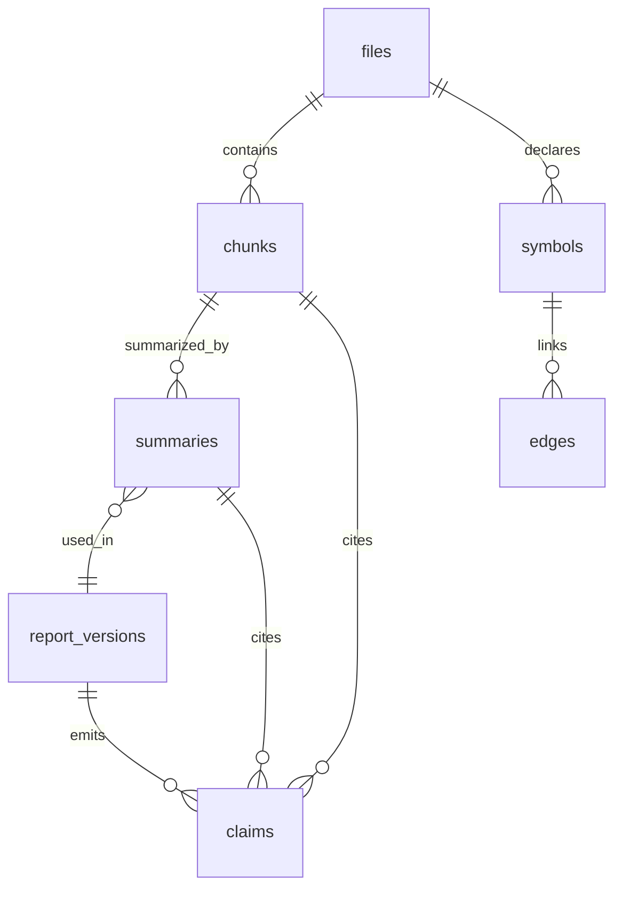
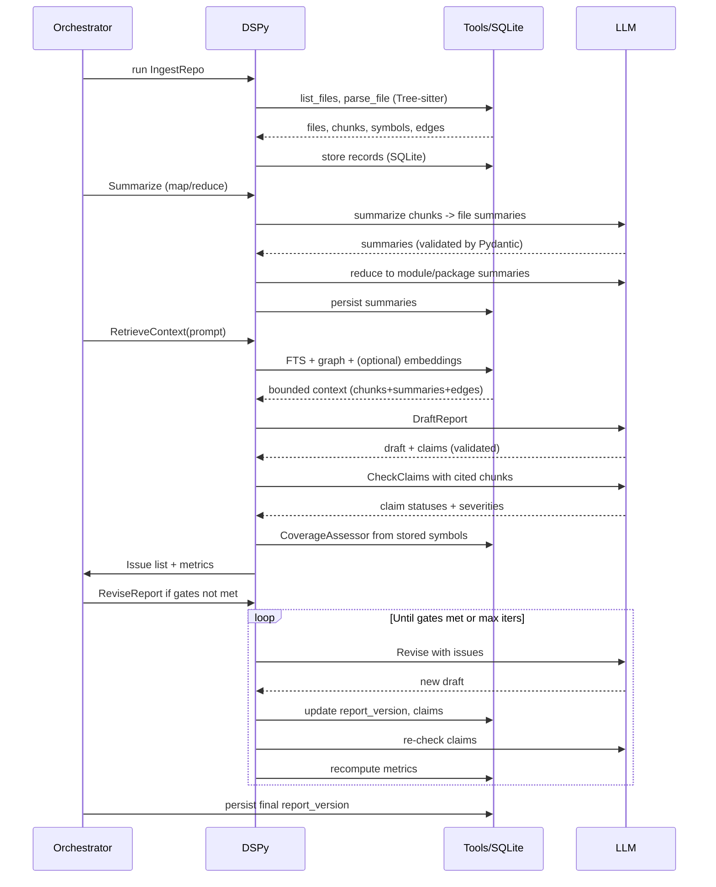

# Infinite-Scalability Tech Writer Agent (with Pydantic + DSPy)

## Goals
- Handle arbitrary-size codebases without context overruns.
- Produce citation-backed, high-coverage reports with measurable quality gates.
- Iterate until thresholds are met; be auditable and rerunnable (all artifacts persisted).
- Primary output is a single Markdown file matching the user’s tech-writing brief; the SQLite store is working state only.

## Key Concepts (MECE)
- **Source of Truth**: Parsed chunks with line ranges + raw text; persisted in SQLite.
- **Summaries**: Multi-level, citation-backed compressions (chunk → file → module → package) for navigation, not ground truth.
- **Graph**: Symbol relationships (imports/calls/inheritance/usage) for structured retrieval.
- **Retrieval**: Hybrid lexical + graph (embeddings optional, post-filtered); never embeddings-only.
- **Claim Checking**: Structured fact verification against cited source chunks.
- **Coverage**: Quantified completeness against expected surface (symbols/endpoints/config/build items).
- **Iteration**: Generate → check → fix until thresholds met; issues tracked with severity.
- **Contracts**: Pydantic models define IO for tools, storage records, and LLM outputs.
- **Orchestration**: DSPy modules encode pipeline stages and tool usage; DSPy compiler can tune prompts/policies.
 
## Infrastructure
- **SQLite**: Primary store (file-based). Enable WAL mode for concurrency; set sensible pragmas (foreign_keys=ON, journal_mode=WAL, synchronous=NORMAL).
- **FTS5**: Virtual tables or indexed views on `chunks.text` and `summaries.text` for lexical search.
- **Optional embeddings**: Store vectors as BLOBs in SQLite; small-k ANN (e.g., cosine via on-disk flat index) or external HNSW if needed; always re-rank lexically/graphically.
- **Tree-sitter**: Language-specific parsing; pluggable grammars.
- **Pydantic**: Models for DB rows, tool IO, LLM IO; validation on ingest and on LLM outputs.
- **DSPy**: Compose modules: ingest → summarize → retrieve → draft → verify → revise; DSPy handles tool selection and prompt tuning under schema constraints.
- **Store lifecycle**: SQLite DB lives in a temp location by default and is deleted after the run; `--persist-store` retains it for later querying/evals.

## Data Model (Pydantic-first)
- `FileRecord`: id:int, path:str, hash:str, lang:str, size:int, mtime:datetime.
- `ChunkRecord`: id:int, file_id:int, start_line:int, end_line:int, kind:str, text:str, hash:str.
- `SymbolRecord`: id:int, file_id:int, name:str, kind:str, signature:str|None, start_line:int, end_line:int, doc:str|None, parent_symbol_id:int|None.
- `EdgeRecord`: src_symbol_id:int, dst_symbol_id:int, edge_type:str (import|call|inherits|uses|exports|declares).
- `SummaryRecord`: id:int, level:Literal["file","module","package"], target_id:int, text:str, confidence:float, created_at:datetime.
- `ClaimRecord`: id:int, report_version:int, text:str, citation_refs:list[str], status:Literal["supported","contradicted","uncertain","missing"], severity:Literal["high","medium","low"], rationale:str.
- `ReportVersionRecord`: id:int, content:str, created_at:datetime, coverage_score:float, citation_score:float, issues_high:int, issues_med:int, issues_low:int.
- Optional: `ChunkEmbedding`: chunk_id:int, vector:bytes, dim:int; `SymbolEmbedding`: symbol_id:int, vector:bytes, dim:int.

## Pydantic Models (tool/LLM IO examples)
- `ToolListFilesRequest{root:str, respect_gitignore:bool}` → `ToolListFilesResponse{files:list[FileRecord]}`
- `ToolGetChunksRequest{path:str, line_range:tuple[int,int]|None}` → `ToolGetChunksResponse{chunks:list[ChunkRecord]}`
- `SummaryOutput{text:str, citations:list[str], confidence:float}`
- `ClaimCheckInput{claim:str, citations:list[str], retrieved_chunks:list[ChunkRecord]}` → `ClaimCheckResult{status, severity, rationale}`
- `Issue{severity, description, fix_hint}`
- `IterationStatus{support_rate:float, coverage:float, citation_rate:float, issues_high:int, issues_med:int}`

## DB Schema Notes
- Primary keys integer autoincrement; foreign keys from chunks/symbols/summaries/edges to files/symbols with `ON DELETE CASCADE`.
- Indexes: files.path unique; chunks(file_id,start_line); symbols(name,kind,lang); edges(src_symbol_id), edges(dst_symbol_id), edges(edge_type); summaries(target_id,level).
- FTS5: `chunks_fts(text, content='chunks', content_rowid='id')`; triggers to sync on insert/update/delete.
- Pragmas at connection: `PRAGMA foreign_keys=ON; PRAGMA journal_mode=WAL; PRAGMA synchronous=NORMAL; PRAGMA temp_store=MEMORY;`.

## Parsing & Chunking (Tree-sitter)
- Per-language parsers; extract symbols and AST-backed chunks (functions/classes/methods). Docs chunked by headings/paragraphs.
- Chunks carry `kind` (function|class|method|block|paragraph).
- Build symbol table; edges for imports, calls, inheritance, member-of, exports.

## Knowledge Build (Bottom-Up)
- Map (DSPy module `SummarizeFile`): for each file, summarize chunks → file summary; include citations (`file:line`). Pydantic-validate `SummaryOutput`.
- Reduce (DSPy module `SummarizeModule`/`SummarizePackage`): aggregate child summaries → higher-level summary with citations and confidence.
- Validation: `SummaryValidator` module samples summaries, opens source chunks, checks presence of key symbols/signatures; flags low confidence.

## Retrieval (Deterministic-First)
- DSPy module `RetrieveContext`: inputs = query/topic; steps:
  - Symbol lookup (exact/regex) + graph expansion.
  - Lexical search via FTS5 on chunks/summaries.
  - Optional embeddings for recall; re-rank by lexical overlap and graph proximity; drop low-overlap.
  - Return bounded set of chunks, summaries, graph edges (validated by Pydantic).

## Report Generation
- DSPy module `DraftReport`: takes prompt + retrieved artifacts; outputs draft with citations.
- Use structured prompt with explicit citation format (`path:line-start-line-end`).
- Pydantic validation on draft claims extraction output.

## Iterative Quality Loop
- `ExtractClaims`: parse draft into `ClaimRecord` candidates (Pydantic).
- `CheckClaims`: for each claim, retrieve cited chunks (+ context) and grade (supported/contradicted/uncertain/missing); assign severity rules.
- `CoverageAssessor`: derive expected surface (symbols/endpoints/config/build targets) per scope; compare to claims; produce coverage score and missing items.
- `IssuePlanner`: build prioritized issue list (high/med/low) from claim checks + coverage gaps.
- `ReviseReport`: apply fixes using issues list; produce new report version; update claims.
- Termination: high == 0; medium below threshold; coverage ≥ target; citation coverage ≥ target; else loop (bounded max iterations with failure report).
- Teardown: emit the final Markdown report. If `--persist-store` is not set, delete the working SQLite DB and temp artifacts; if set, keep them for post-hoc queries/evals.

## Output & Store Lifecycle
- **Primary artifact**: single Markdown report matching the prompt/brief.
- **Working store**: SQLite DB used during the run. Default: created in a temp path (e.g., `.cache/tech-writer/run-<ts>.db`) and deleted on success/failure.
- **Persistence flag**: `--persist-store` retains the DB (and logs) for inspection, debugging, and evaluations.
- **Post-run tools (when persisted)**:
  - `list_files()`, `get_file(path)` → file/chunk/symbol metadata.
  - `search_chunks(query, fts=true, regex=false)` → chunks with line ranges.
  - `get_symbol(name|regex)`, `symbol_neighbors(symbol_id, edge_type)`.
  - `get_summary(level, target_id)`.
  - `get_report_versions()`, `get_claims(report_version_id)`, `export_report(report_version_id)` → Markdown content (primary artifact).

## DSPy Module Sketch (signatures)
- `IngestRepo(root: str) -> list[FileRecord]`
- `ParseFile(file: FileRecord) -> list[ChunkRecord], list[SymbolRecord], list[EdgeRecord]`
- `SummarizeFile(chunks: list[ChunkRecord]) -> SummaryRecord`
- `SummarizeModule(children: list[SummaryRecord]) -> SummaryRecord`
- `RetrieveContext(query: str, scope: str) -> RetrievedContext(chunks, summaries, edges, symbols)`
- `DraftReport(prompt: str, context: RetrievedContext) -> Draft(text, claims: list[ClaimRecord])`
- `CheckClaims(claims: list[ClaimRecord], context_provider) -> list[ClaimRecord]`
- `CoverageAssessor(scope: str, store) -> CoverageResult(expected_items, covered_items, score)`
- `IssuePlanner(claims, coverage) -> list[Issue]`
- `ReviseReport(draft, issues) -> Draft`
- `Gatekeeper(status: IterationStatus) -> bool` (decide continue/stop)

## Reliability Tactics
- Raw chunks retained; citations required; verification reopens source.
- Pydantic validation on all tool/LLM IO; retries on validation failures.
- Hybrid retrieval with deterministic filters; embeddings helper-only.
- Confidence tagging; low-confidence summaries trigger drill-down.
- Logging and artifacts: retrieval sets, issue lists, rationales per iteration stored in DB.

## Evals & Quality Gates
- Claim Support: support rate; contradictions; missing/uncertain. Gates: high contradictions = 0; support ≥ target (e.g., 0.9); missing-citation ≤ target.
- Coverage: % expected items (symbols/endpoints/config/build targets) mentioned with evidence. Gate: e.g., ≥0.9.
- Citation Coverage: % claims/paragraphs with valid citations; dangling citations flagged. Gate: e.g., ≥0.95.
- Spot-Check: sample N claims; deterministic or secondary LLM check vs source; report pass rate.
- Regression (optional): compare to prior approved report; flag regressions in support/coverage.
- Iteration criteria: continue until gates met or max iterations; on fail, emit issue list + rationale.
- Evaluations should run with `--persist-store` to allow post-hoc querying and auditor tools over the stored artifacts.

## Test Approach (what remains to implement)
- Unit tests (SQLite in tmpdir, Pydantic validation) for:
  - Parsing/chunking per language.
  - DB persistence and retrieval queries (FTS, graph neighbors).
  - Pydantic validation of tool IO and LLM outputs (happy path + failure retries).
  - Coverage and claim-check scoring logic (deterministic fixtures).
- Integration tests (small repos):
  - End-to-end ingest → summarize → draft → verify → revise with stub LLMs.
  - Iteration loop termination criteria behavior.
- Property tests:
  - Idempotent ingest on unchanged files (hash-based skip).
  - Summaries always include valid citations.
- Golden tests:
  - Fixed small repo + prompt; assert metrics (support/coverage) meet thresholds with recorded snapshots.

## Mermaid: Entity Relationships

## Mermaid: Golden Path Sequence

## Mermaid: Error/Alternate Flows
- **Validation Fail (LLM output malformed)**: Pydantic rejects → retry with stricter prompt → if still fails, log and mark iteration failure; stop or fallback model.
- **Retrieval returns insufficient evidence**: expand scope (wider FTS/graph radius); if still empty, flag coverage gap (medium/high).
- **Coverage below gate after max iterations**: emit failure report + outstanding issues; no final publish.
- **Changed files mid-run**: hash mismatch triggers re-ingest for affected files; invalidate dependent summaries; redo reduce layer before next iteration.
