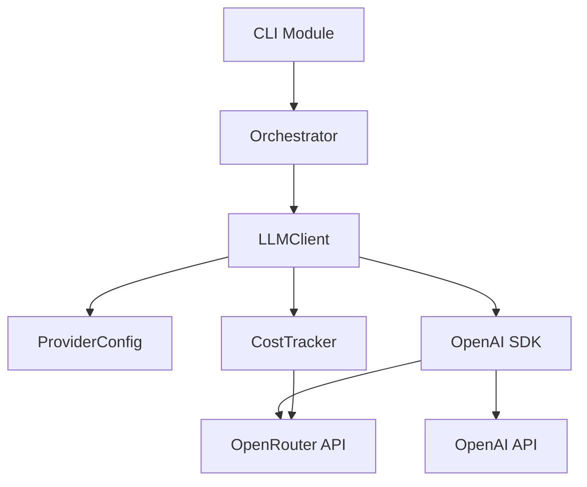
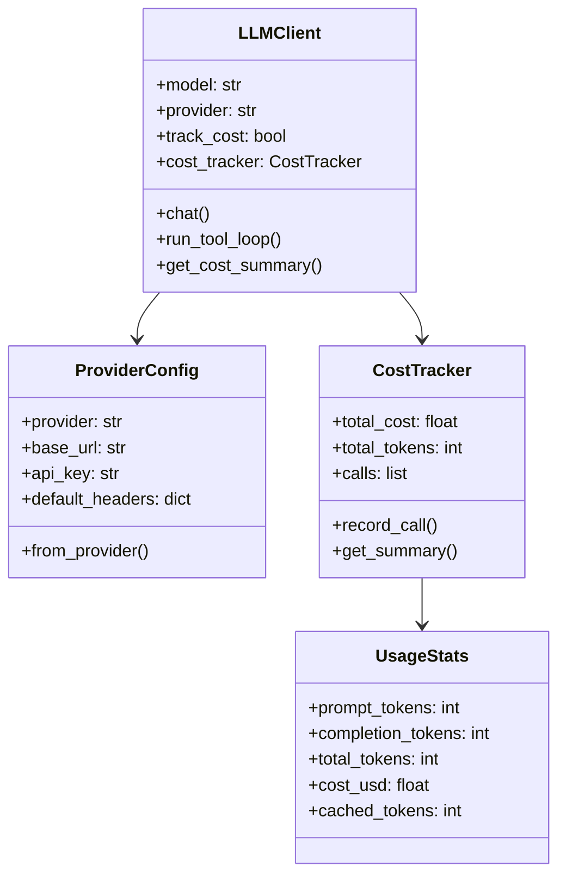
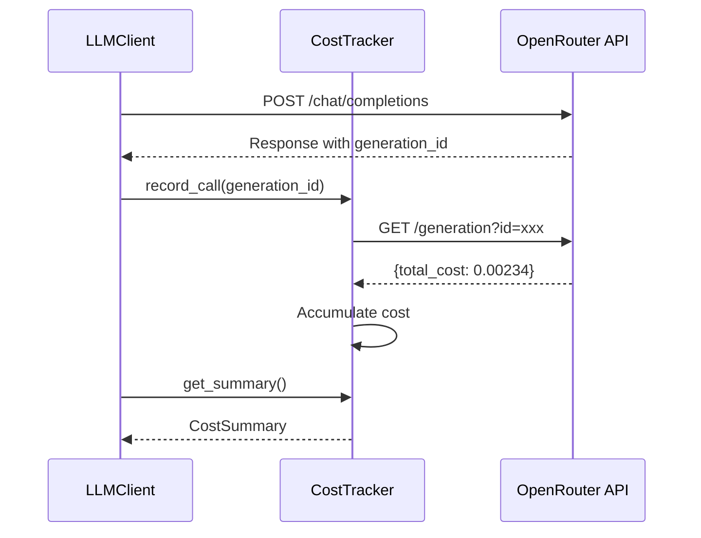
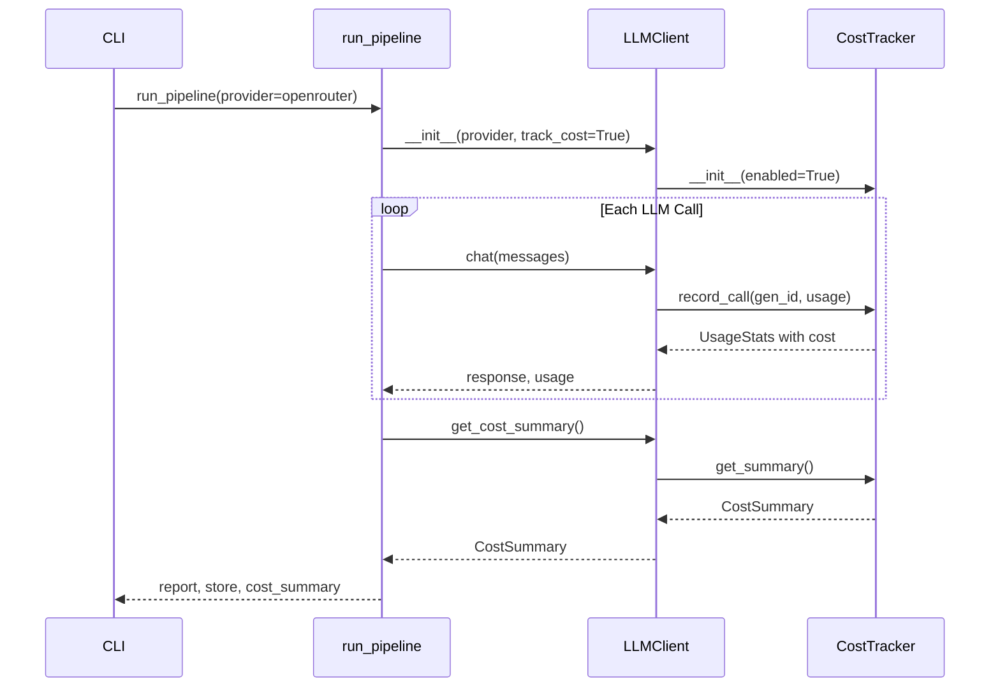

# Feature 1: OpenRouter Integration - Technical Design

## 1. Overview

This document specifies the technical design for integrating OpenRouter as an LLM API provider, enabling multi-provider model access and automatic cost tracking.

## 2. Architecture

### 2.1 Component Diagram



### 2.2 Class Diagram



## 3. Data Types

### 3.1 UsageStats

```python
@dataclass
class UsageStats:
    """Token and cost statistics for a single LLM call."""
    prompt_tokens: int
    completion_tokens: int
    total_tokens: int
    cost_usd: Optional[float] = None
    cached_tokens: int = 0
    cache_discount: float = 0.0
    generation_id: Optional[str] = None
```

### 3.2 ProviderConfig

```python
@dataclass
class ProviderConfig:
    """Configuration for an LLM provider."""
    provider: Literal["openai", "openrouter"]
    base_url: Optional[str]
    api_key: str
    default_headers: dict[str, str]

    @classmethod
    def from_provider(
        cls,
        provider: str,
        api_key: Optional[str] = None,
        base_url: Optional[str] = None,
        app_name: str = "tech_writer",
        app_url: str = "https://github.com/user/tech_writer",
    ) -> "ProviderConfig":
        """Factory method to create config from provider name."""
        ...
```

### 3.3 CostSummary

```python
@dataclass
class CostSummary:
    """Cumulative cost statistics for a pipeline run."""
    total_cost_usd: float
    total_tokens: int
    total_calls: int
    provider: str
    model: str
    calls: list[UsageStats]
```

## 4. Provider Configuration

### 4.1 OpenAI Configuration

| Setting | Value |
|---------|-------|
| Base URL | `None` (uses SDK default) |
| API Key Env | `OPENAI_API_KEY` |
| Headers | None required |
| Model Format | `gpt-5.1`, `gpt-4o` |

### 4.2 OpenRouter Configuration

| Setting | Value |
|---------|-------|
| Base URL | `https://openrouter.ai/api/v1` |
| API Key Env | `OPENROUTER_API_KEY` |
| Required Headers | `HTTP-Referer`, `X-Title` |
| Model Format | `provider/model` (e.g., `openai/gpt-5.1`) |

### 4.3 ProviderConfig.from_provider() Logic

```
IF provider == "openrouter":
    api_key = api_key OR env("OPENROUTER_API_KEY")
    base_url = base_url OR "https://openrouter.ai/api/v1"
    headers = {
        "HTTP-Referer": app_url,
        "X-Title": app_name,
    }
ELSE IF provider == "openai":
    api_key = api_key OR env("OPENAI_API_KEY")
    base_url = base_url OR None
    headers = {}
ELSE:
    RAISE ValueError("Unknown provider")
```

## 5. Cost Tracking

### 5.1 Cost Tracking Flow



### 5.2 CostTracker Class

```python
class CostTracker:
    """Tracks cumulative costs across LLM calls."""

    OPENROUTER_GENERATION_URL = "https://openrouter.ai/api/v1/generation"

    def __init__(self, api_key: str, enabled: bool = True):
        self.api_key = api_key
        self.enabled = enabled
        self.total_cost: float = 0.0
        self.total_tokens: int = 0
        self.calls: list[UsageStats] = []

    def record_call(
        self,
        generation_id: str,
        usage: UsageStats,
    ) -> UsageStats:
        """Record a call and fetch its cost."""
        ...

    def _fetch_generation_cost(self, generation_id: str) -> Optional[float]:
        """Query OpenRouter for generation cost."""
        ...

    def get_summary(self, provider: str, model: str) -> CostSummary:
        """Return cumulative statistics."""
        ...
```

### 5.3 _fetch_generation_cost() Logic

```
REQUEST:
    GET {OPENROUTER_GENERATION_URL}?id={generation_id}
    Headers: Authorization: Bearer {api_key}

RESPONSE (200):
    {
        "id": "gen-xxxxx",
        "total_cost": 0.00234,
        "native_tokens_prompt": 145,
        "native_tokens_completion": 48,
        "cache_discount": 0
    }

ON SUCCESS:
    RETURN response.total_cost
ON ERROR:
    LOG warning
    RETURN None
```

## 6. LLMClient Modifications

### 6.1 Constructor Changes

```python
def __init__(
    self,
    model: str = "gpt-5.1",
    provider: str = "openai",
    api_key: Optional[str] = None,
    base_url: Optional[str] = None,
    track_cost: Optional[bool] = None,
    app_name: str = "tech_writer",
    app_url: str = "https://github.com/user/tech_writer",
):
    self.model = model
    self.provider = provider

    # Cost tracking: default True for OpenRouter, False for OpenAI
    self.track_cost = track_cost if track_cost is not None else (provider == "openrouter")

    # Configure provider
    self.config = ProviderConfig.from_provider(
        provider=provider,
        api_key=api_key,
        base_url=base_url,
        app_name=app_name,
        app_url=app_url,
    )

    # Initialize cost tracker
    self.cost_tracker = CostTracker(
        api_key=self.config.api_key,
        enabled=self.track_cost,
    )

    # Initialize OpenAI client
    self._client = OpenAI(
        api_key=self.config.api_key,
        base_url=self.config.base_url,
        default_headers=self.config.default_headers,
    )
```

### 6.2 chat() Method Changes

```python
def chat(
    self,
    messages: list[dict],
    tools: Optional[list[dict]] = None,
    tool_choice: Optional[str] = None,
    step: Optional[int] = None,
    phase: Optional[str] = None,
) -> tuple[dict, UsageStats]:
    """
    Send chat completion request.

    Returns:
        Tuple of (response_dict, usage_stats)
    """
    kwargs = {
        "model": self.model,
        "messages": messages,
    }

    if tools:
        kwargs["tools"] = tools
        if tool_choice:
            kwargs["tool_choice"] = tool_choice

    # Enable usage tracking for OpenRouter
    if self.provider == "openrouter":
        kwargs["extra_body"] = {"usage": {"include": True}}

    # Make request
    response = self._client.chat.completions.create(**kwargs)

    # Extract usage
    usage = UsageStats(
        prompt_tokens=response.usage.prompt_tokens if response.usage else 0,
        completion_tokens=response.usage.completion_tokens if response.usage else 0,
        total_tokens=response.usage.total_tokens if response.usage else 0,
        generation_id=response.id,
    )

    # Track cost if enabled
    if self.track_cost and self.provider == "openrouter":
        usage = self.cost_tracker.record_call(response.id, usage)

    # Parse and return
    return self._parse_response(response), usage
```

### 6.3 get_cost_summary() Method

```python
def get_cost_summary(self) -> CostSummary:
    """Return cumulative cost statistics for this client."""
    return self.cost_tracker.get_summary(
        provider=self.provider,
        model=self.model,
    )
```

## 7. CLI Changes

### 7.1 New Arguments

| Argument | Type | Default | Description |
|----------|------|---------|-------------|
| `--provider` | choice | `openai` | LLM provider: `openai` or `openrouter` |
| `--no-track-cost` | flag | False | Disable cost tracking |

### 7.2 Argument Definitions

```python
parser.add_argument(
    "--provider",
    choices=["openai", "openrouter"],
    default="openai",
    help="LLM provider (default: openai)",
)

parser.add_argument(
    "--no-track-cost",
    action="store_true",
    help="Disable cost tracking (enabled by default for OpenRouter)",
)
```

### 7.3 Argument Processing

```python
# Determine track_cost setting
if args.provider == "openrouter" and not args.no_track_cost:
    track_cost = True
else:
    track_cost = False
```

## 8. Pipeline Integration

### 8.1 run_pipeline() Signature Change

```python
def run_pipeline(
    prompt: str,
    repo: str,
    cache_dir: Optional[str] = None,
    model: str = "gpt-5.1",
    provider: str = "openai",
    api_key: Optional[str] = None,
    base_url: Optional[str] = None,
    max_exploration: int = DEFAULT_MAX_EXPLORATION_STEPS,
    max_sections: int = DEFAULT_MAX_SECTIONS,
    db_path: Optional[str] = None,
    log_level: Optional[str] = None,
    track_cost: bool = False,
) -> tuple[str, CacheStore, CostSummary]:
    """
    Run the full documentation pipeline.

    Returns:
        Tuple of (report_markdown, cache_store, cost_summary)
    """
```

### 8.2 Pipeline Flow with Cost Tracking



## 9. JSON Output

### 9.1 Output Structure

```python
@dataclass
class ReportOutput:
    """JSON output structure."""
    report: str
    citations: Optional[CitationResults]
    cost: Optional[CostSummary]
```

### 9.2 Example Output

```json
{
  "report": "# Architecture Overview\n...",
  "citations": {
    "total": 45,
    "valid": 42,
    "invalid": 3
  },
  "cost": {
    "total_cost_usd": 0.0234,
    "total_tokens": 15420,
    "total_calls": 12,
    "provider": "openrouter",
    "model": "openai/gpt-5.1"
  }
}
```

## 10. Error Handling

### 10.1 Provider Errors

| Error | Handling |
|-------|----------|
| Missing API key | Raise `ValueError` with clear message |
| Unknown provider | Raise `ValueError` listing valid providers |
| API connection failure | Raise `ConnectionError` with URL |

### 10.2 Cost Tracking Errors

| Error | Handling |
|-------|----------|
| Generation endpoint 404 | Log warning, set cost to None |
| Generation endpoint timeout | Log warning, set cost to None |
| Invalid response format | Log warning, set cost to None |

Cost tracking errors are non-fatal; the pipeline continues with `cost_usd=None` for affected calls.

## 11. Testing

### 11.1 Unit Tests

#### 11.1.1 ProviderConfig Tests

```python
class TestProviderConfig:
    def test_openai_config(self):
        """OpenAI config uses correct defaults."""

    def test_openrouter_config(self):
        """OpenRouter config sets base_url and headers."""

    def test_openrouter_requires_referer(self):
        """OpenRouter config includes HTTP-Referer header."""

    def test_unknown_provider_raises(self):
        """Unknown provider raises ValueError."""
```

#### 11.1.2 CostTracker Tests

```python
class TestCostTracker:
    def test_disabled_tracker_skips_fetch(self):
        """Disabled tracker doesn't call API."""

    def test_accumulates_costs(self):
        """Costs accumulate across calls."""

    def test_handles_fetch_error(self):
        """API errors don't crash tracker."""

    def test_summary_includes_all_calls(self):
        """Summary includes all recorded calls."""
```

#### 11.1.3 LLMClient Tests

```python
class TestLLMClient:
    def test_openai_provider_no_extra_headers(self):
        """OpenAI provider doesn't add extra headers."""

    def test_openrouter_provider_sets_headers(self):
        """OpenRouter provider sets required headers."""

    def test_track_cost_default_openrouter(self):
        """track_cost defaults to True for OpenRouter."""

    def test_track_cost_default_openai(self):
        """track_cost defaults to False for OpenAI."""

    def test_extra_body_for_openrouter(self):
        """OpenRouter requests include usage in extra_body."""
```

### 11.2 Integration Tests

```python
class TestOpenRouterIntegration:
    """Integration tests (require OPENROUTER_API_KEY)."""

    @pytest.mark.integration
    def test_chat_returns_cost(self):
        """Chat request returns cost in UsageStats."""

    @pytest.mark.integration
    def test_cost_accumulates(self):
        """Multiple calls accumulate total cost."""

    @pytest.mark.integration
    def test_json_output_includes_cost(self):
        """CLI JSON output includes cost field."""
```

### 11.3 BDD Feature Test

```gherkin
Feature: OpenRouter Integration
  As a developer
  I want to use OpenRouter as my LLM provider
  So that I can access multiple models and track costs

  Scenario: Generate report with OpenRouter
    Given I have an OpenRouter API key
    When I run tech_writer with --provider openrouter
    Then the report should be generated successfully
    And the output should include cost information

  Scenario: Cost tracking is enabled by default
    Given I have an OpenRouter API key
    When I run tech_writer with --provider openrouter
    And I do not specify --no-track-cost
    Then cost tracking should be enabled
    And total_cost_usd should be greater than 0

  Scenario: Disable cost tracking
    Given I have an OpenRouter API key
    When I run tech_writer with --provider openrouter --no-track-cost
    Then cost tracking should be disabled
    And cost should be null in the output

  Scenario: Use non-OpenAI model via OpenRouter
    Given I have an OpenRouter API key
    When I run tech_writer with --provider openrouter --model anthropic/claude-sonnet-4
    Then the report should be generated using Claude
    And the cost should reflect Claude pricing
```

## 12. File Changes Summary

| File | Changes |
|------|---------|
| `tech_writer/llm.py` | Add `ProviderConfig`, `CostTracker`, `UsageStats`; modify `LLMClient` |
| `tech_writer/orchestrator.py` | Add `provider` and `track_cost` params; return `CostSummary` |
| `tech_writer/cli.py` | Add `--provider` and `--no-track-cost` args |
| `tests/tech_writer/test_llm.py` | Add unit tests for new classes |
| `tests/tech_writer/test_integration.py` | Add OpenRouter integration tests |
| `tests/features/openrouter.feature` | Add BDD feature tests |

## 13. Dependencies

### 13.1 New Dependencies

| Package | Version | Purpose |
|---------|---------|---------|
| `httpx` | `>=0.24.0` | HTTP client for generation API |

### 13.2 Existing Dependencies (no changes)

- `openai` - Already used, OpenRouter is API-compatible

## 14. References

- [OpenRouter Quickstart](https://openrouter.ai/docs/quickstart)
- [OpenRouter Usage Accounting](https://openrouter.ai/docs/use-cases/usage-accounting)
- [OpenRouter API Parameters](https://openrouter.ai/docs/api-reference/parameters)
- [OpenRouter Models](https://openrouter.ai/models)
