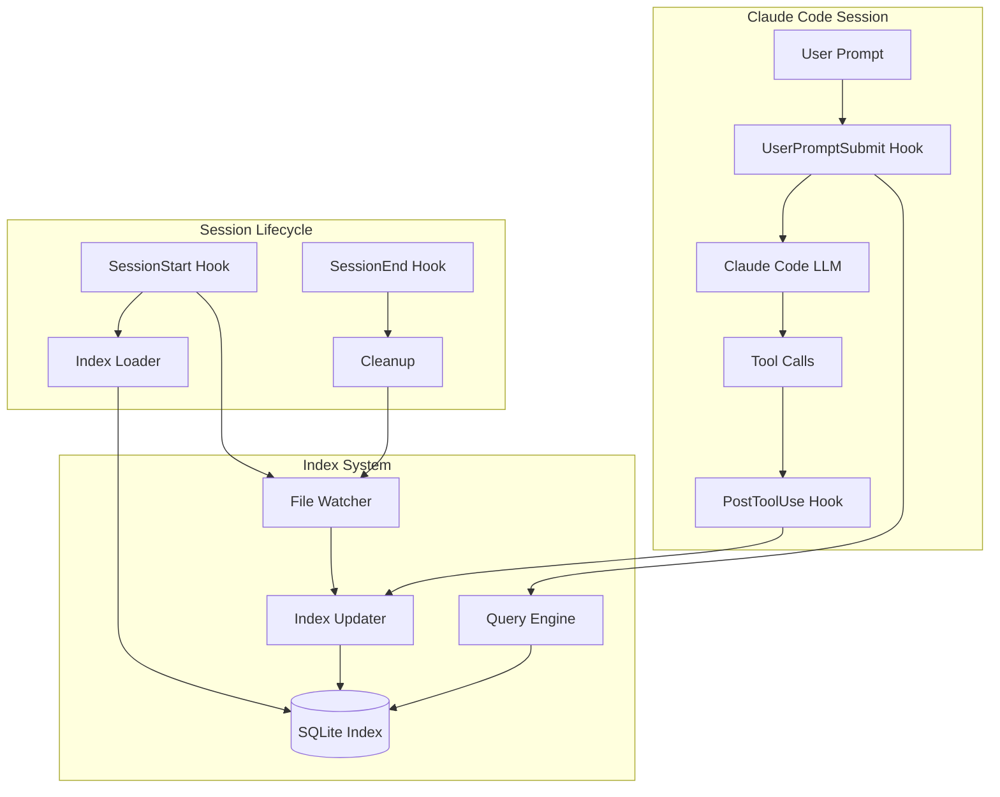
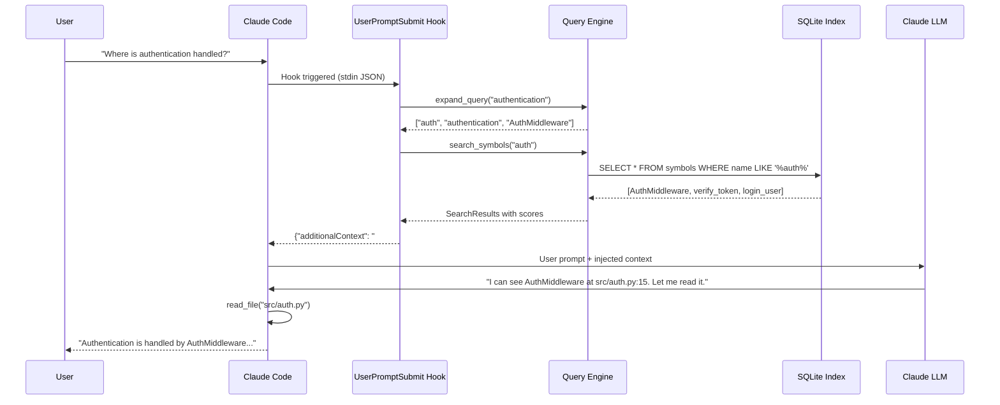
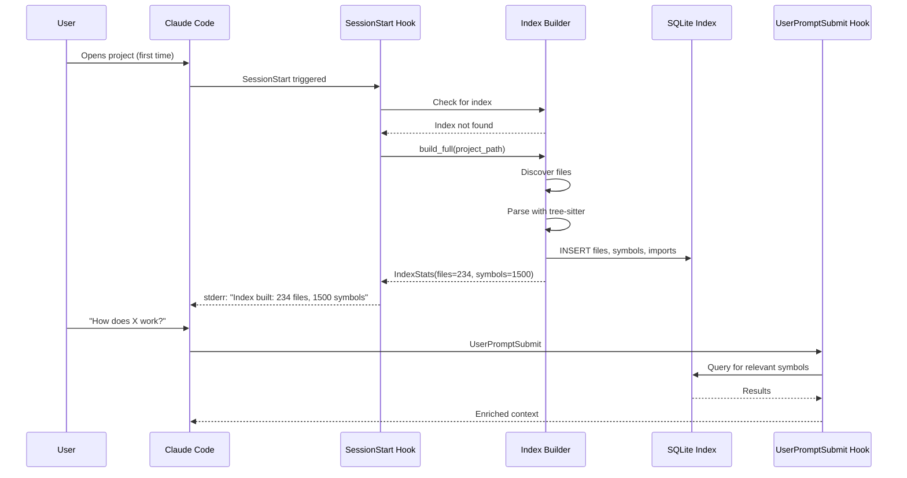
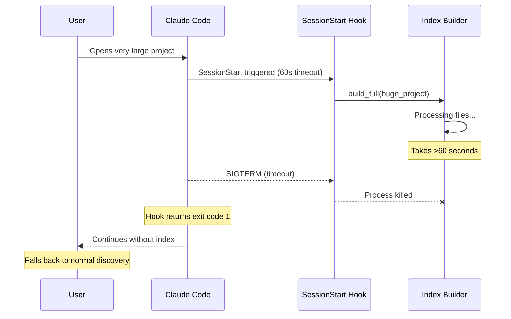
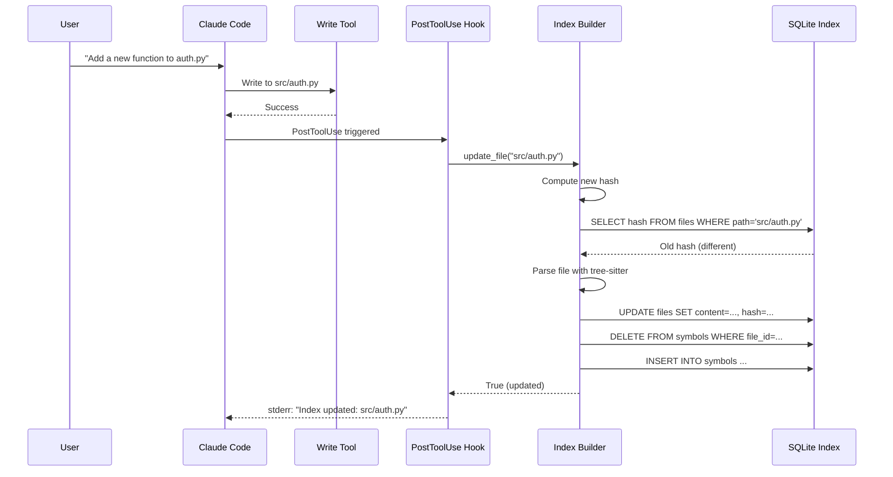

# Feature 4: Claude Code Prompt Enrichment - Technical Design

## 1. Overview

This feature implements a Claude Code hook-based system that enriches user prompts with pre-indexed code context, reducing LLM discovery calls by 80-90%.

### 1.1 Architecture Summary



### 1.2 Component Responsibilities

| Component | Responsibility |
|-----------|---------------|
| Index Builder | Parse files, extract symbols, populate SQLite |
| Query Engine | Match user prompts to relevant symbols |
| Hook Scripts | Bridge between Claude Code events and index |
| File Watcher | Detect external file changes |
| Index Updater | Incrementally update index on changes |

---

## 2. Data Model

### 2.1 SQLite Schema

```sql
-- Core file storage
CREATE TABLE files (
    id INTEGER PRIMARY KEY,
    path TEXT UNIQUE NOT NULL,
    content TEXT,
    lang TEXT NOT NULL,
    line_count INTEGER,
    hash TEXT NOT NULL,           -- SHA256 prefix for change detection
    indexed_at TEXT NOT NULL      -- ISO timestamp
);

-- Symbol definitions (functions, classes, methods, etc.)
CREATE TABLE symbols (
    id INTEGER PRIMARY KEY,
    file_id INTEGER NOT NULL REFERENCES files(id) ON DELETE CASCADE,
    name TEXT NOT NULL,
    kind TEXT NOT NULL,           -- 'function', 'class', 'method', 'variable'
    line INTEGER NOT NULL,
    end_line INTEGER,
    signature TEXT,               -- e.g., "def foo(x: int, y: str) -> bool"
    doc TEXT,                     -- Docstring/comment
    parent_id INTEGER REFERENCES symbols(id)  -- For nested symbols
);

-- Import statements
CREATE TABLE imports (
    id INTEGER PRIMARY KEY,
    file_id INTEGER NOT NULL REFERENCES files(id) ON DELETE CASCADE,
    line INTEGER NOT NULL,
    imported_name TEXT NOT NULL,  -- What's being imported
    imported_from TEXT,           -- Module/file path (NULL for bare imports)
    alias TEXT                    -- Import alias if any
);

-- Full-text search on content
CREATE VIRTUAL TABLE files_fts USING fts5(
    path,
    content,
    content=files,
    content_rowid=id
);

-- Indexes for fast lookup
CREATE INDEX idx_symbols_name ON symbols(name);
CREATE INDEX idx_symbols_kind ON symbols(kind);
CREATE INDEX idx_symbols_file ON symbols(file_id);
CREATE INDEX idx_imports_name ON imports(imported_name);
CREATE INDEX idx_imports_from ON imports(imported_from);
CREATE INDEX idx_files_hash ON files(hash);
```

### 2.2 Python Types

```python
# tech_writer/index/types.py

from dataclasses import dataclass
from enum import Enum
from typing import Optional
from datetime import datetime


class SymbolKind(Enum):
    """Types of symbols that can be indexed."""
    FUNCTION = "function"
    CLASS = "class"
    METHOD = "method"
    VARIABLE = "variable"
    CONSTANT = "constant"
    INTERFACE = "interface"
    MODULE = "module"


@dataclass(frozen=True)
class FileInfo:
    """Metadata about an indexed file."""
    id: int
    path: str
    lang: str
    line_count: int
    hash: str
    indexed_at: datetime


@dataclass(frozen=True)
class Symbol:
    """A code symbol (function, class, etc.)."""
    id: int
    file_id: int
    name: str
    kind: SymbolKind
    line: int
    end_line: Optional[int]
    signature: Optional[str]
    doc: Optional[str]
    parent_id: Optional[int]


@dataclass(frozen=True)
class Import:
    """An import statement."""
    id: int
    file_id: int
    line: int
    imported_name: str
    imported_from: Optional[str]
    alias: Optional[str]


@dataclass(frozen=True)
class SearchResult:
    """A search result with relevance score."""
    symbol: Symbol
    file_path: str
    score: float
    context: str  # Surrounding code snippet


@dataclass
class IndexStats:
    """Statistics about the index."""
    total_files: int
    total_symbols: int
    total_imports: int
    languages: dict[str, int]  # lang -> file count
    last_updated: datetime
```

---

## 3. Component Design

### 3.1 Index Builder

#### 3.1.1 Module Structure

```
tech_writer/index/
├── __init__.py
├── types.py          # Dataclasses defined above
├── schema.py         # SQL schema and migrations
├── builder.py        # Index construction
├── parser.py         # Tree-sitter parsing
├── queries.py        # Language-specific tree-sitter queries
├── updater.py        # Incremental updates
├── search.py         # Query engine
└── watcher.py        # File system monitoring
```

#### 3.1.2 Builder Interface

```python
# tech_writer/index/builder.py

from pathlib import Path
from typing import Iterator, Optional
import sqlite3

from .types import FileInfo, Symbol, Import, IndexStats


class IndexBuilder:
    """Builds and maintains the code index."""

    # Supported file extensions by language
    LANGUAGE_EXTENSIONS: dict[str, list[str]] = {
        "python": [".py", ".pyi"],
        "javascript": [".js", ".jsx", ".mjs"],
        "typescript": [".ts", ".tsx"],
        "go": [".go"],
        "rust": [".rs"],
        "ruby": [".rb"],
        "java": [".java"],
        "php": [".php"],
        "cpp": [".cpp", ".cc", ".cxx", ".hpp", ".h"],
    }

    # Directories to skip
    SKIP_DIRS: set[str] = {
        "node_modules", ".git", "__pycache__", ".venv",
        "venv", "dist", "build", ".next", "target"
    }

    def __init__(self, db_path: Path):
        """Initialize builder with database path."""
        ...

    def build_full(self, repo_path: Path) -> IndexStats:
        """
        Build complete index for a repository.

        Args:
            repo_path: Root directory to index

        Returns:
            Statistics about the built index
        """
        ...

    def update_file(self, file_path: Path) -> bool:
        """
        Update index for a single file.

        Args:
            file_path: Path to the changed file

        Returns:
            True if file was updated, False if unchanged
        """
        ...

    def remove_file(self, file_path: Path) -> bool:
        """
        Remove a file from the index.

        Args:
            file_path: Path to the deleted file

        Returns:
            True if file was removed, False if not found
        """
        ...

    def get_stats(self) -> IndexStats:
        """Get current index statistics."""
        ...

    def _discover_files(self, repo_path: Path) -> Iterator[Path]:
        """Yield all indexable files in repository."""
        ...

    def _compute_hash(self, content: str) -> str:
        """Compute content hash for change detection."""
        ...

    def _detect_language(self, path: Path) -> Optional[str]:
        """Detect language from file extension."""
        ...
```

#### 3.1.3 Parser Interface

```python
# tech_writer/index/parser.py

from pathlib import Path
from typing import Iterator

from .types import Symbol, Import


class CodeParser:
    """Parses source files using tree-sitter."""

    def __init__(self):
        """Initialize parser with language grammars."""
        ...

    def parse_file(self, path: Path, content: str, lang: str) -> tuple[list[Symbol], list[Import]]:
        """
        Parse a file and extract symbols and imports.

        Args:
            path: File path (for error reporting)
            content: File content
            lang: Language identifier

        Returns:
            Tuple of (symbols, imports)
        """
        ...

    def _load_grammar(self, lang: str) -> None:
        """Load tree-sitter grammar for language."""
        ...

    def _run_query(self, tree, query: str) -> Iterator[dict]:
        """Run tree-sitter query and yield captures."""
        ...
```

### 3.2 Query Engine

#### 3.2.1 Search Interface

```python
# tech_writer/index/search.py

from pathlib import Path
from typing import Optional

from .types import SearchResult, Symbol


# Maximum results to return per query
MAX_RESULTS = 15

# Maximum context lines around a symbol
CONTEXT_LINES = 3


class QueryEngine:
    """Searches the code index."""

    def __init__(self, db_path: Path):
        """Initialize with database path."""
        ...

    def search_symbols(
        self,
        query: str,
        kinds: Optional[list[str]] = None,
        limit: int = MAX_RESULTS
    ) -> list[SearchResult]:
        """
        Search for symbols matching query.

        Args:
            query: Search terms (supports wildcards)
            kinds: Filter by symbol kinds (e.g., ['function', 'class'])
            limit: Maximum results

        Returns:
            List of search results with scores
        """
        ...

    def search_content(
        self,
        query: str,
        limit: int = MAX_RESULTS
    ) -> list[SearchResult]:
        """
        Full-text search in file content.

        Args:
            query: FTS5 query string
            limit: Maximum results

        Returns:
            List of search results
        """
        ...

    def find_definition(self, name: str) -> Optional[Symbol]:
        """
        Find the definition of a symbol by exact name.

        Args:
            name: Symbol name to find

        Returns:
            Symbol if found, None otherwise
        """
        ...

    def find_importers(self, module_path: str) -> list[str]:
        """
        Find all files that import a given module.

        Args:
            module_path: Module path to search for

        Returns:
            List of file paths that import this module
        """
        ...

    def get_file_symbols(self, file_path: str) -> list[Symbol]:
        """
        Get all symbols defined in a file.

        Args:
            file_path: Path to the file

        Returns:
            List of symbols in the file
        """
        ...

    def expand_query(self, natural_query: str) -> list[str]:
        """
        Expand natural language query to code search terms.

        Extracts:
        - CamelCase identifiers
        - snake_case identifiers
        - Quoted strings
        - Backtick code references

        Args:
            natural_query: User's natural language query

        Returns:
            List of extracted search terms
        """
        ...
```

### 3.3 Hook Scripts

#### 3.3.1 Hook Configuration

```json
// .claude/settings.json
{
  "hooks": {
    "SessionStart": [{
      "hooks": [{
        "type": "command",
        "command": "python -m tech_writer.hooks.session_start",
        "timeout": 30
      }]
    }],
    "PostToolUse": [{
      "matcher": "Write|Edit",
      "hooks": [{
        "type": "command",
        "command": "python -m tech_writer.hooks.post_tool_use"
      }]
    }],
    "UserPromptSubmit": [{
      "hooks": [{
        "type": "command",
        "command": "python -m tech_writer.hooks.user_prompt_submit"
      }]
    }],
    "SessionEnd": [{
      "hooks": [{
        "type": "command",
        "command": "python -m tech_writer.hooks.session_end"
      }]
    }]
  }
}
```

#### 3.3.2 Hook Module Structure

```
tech_writer/hooks/
├── __init__.py
├── session_start.py    # Initialize index, start watcher
├── post_tool_use.py    # Update index on file changes
├── user_prompt_submit.py  # Inject context into prompt
├── session_end.py      # Cleanup watcher
└── common.py           # Shared utilities
```

#### 3.3.3 SessionStart Hook

```python
# tech_writer/hooks/session_start.py

"""
SessionStart hook: Initialize index and file watcher.

Input (stdin JSON):
{
    "session_id": "...",
    "hook_event_name": "SessionStart",
    "cwd": "/path/to/project"
}

Output: None (stderr for logging)
Exit codes: 0=success, 1=warning, 2=block
"""

import json
import sys
import os
from pathlib import Path

from tech_writer.index.builder import IndexBuilder
from tech_writer.index.watcher import start_watcher

# Index location relative to project root
INDEX_DIR = ".tech_writer"
INDEX_DB = "index.db"
WATCHER_PID_FILE = "watcher.pid"


def main() -> int:
    """Main hook entry point."""
    input_data = json.load(sys.stdin)
    project_dir = Path(input_data.get("cwd", os.getcwd()))

    index_dir = project_dir / INDEX_DIR
    index_dir.mkdir(exist_ok=True)
    db_path = index_dir / INDEX_DB

    builder = IndexBuilder(db_path)

    # Check if index exists and is fresh
    if db_path.exists():
        stats = builder.get_stats()
        print(f"Index loaded: {stats.total_files} files, {stats.total_symbols} symbols",
              file=sys.stderr)
    else:
        # Build initial index
        print("Building index...", file=sys.stderr)
        stats = builder.build_full(project_dir)
        print(f"Index built: {stats.total_files} files, {stats.total_symbols} symbols",
              file=sys.stderr)

    # Start file watcher
    pid = start_watcher(project_dir, db_path)
    if pid:
        pid_file = index_dir / WATCHER_PID_FILE
        pid_file.write_text(str(pid))
        print(f"File watcher started (PID {pid})", file=sys.stderr)

    return 0


if __name__ == "__main__":
    sys.exit(main())
```

#### 3.3.4 UserPromptSubmit Hook

```python
# tech_writer/hooks/user_prompt_submit.py

"""
UserPromptSubmit hook: Inject relevant code context into prompt.

Input (stdin JSON):
{
    "session_id": "...",
    "hook_event_name": "UserPromptSubmit",
    "user_prompt": "How does authentication work?",
    "cwd": "/path/to/project"
}

Output (stdout JSON):
{
    "additionalContext": "## Pre-indexed Code\n..."
}

Exit codes: 0=success (with or without context)
"""

import json
import sys
import os
from pathlib import Path

from tech_writer.index.search import QueryEngine, MAX_RESULTS

# Maximum characters of context to inject
MAX_CONTEXT_CHARS = 2000


def main() -> int:
    """Main hook entry point."""
    input_data = json.load(sys.stdin)
    user_prompt = input_data.get("user_prompt", "")
    project_dir = Path(input_data.get("cwd", os.getcwd()))

    db_path = project_dir / ".tech_writer" / "index.db"
    if not db_path.exists():
        # No index, skip enrichment
        return 0

    engine = QueryEngine(db_path)

    # Extract search terms from prompt
    terms = engine.expand_query(user_prompt)
    if not terms:
        return 0

    # Search for relevant symbols
    results = []
    for term in terms[:5]:  # Limit terms to avoid over-fetching
        results.extend(engine.search_symbols(term, limit=5))

    # Deduplicate and sort by relevance
    seen = set()
    unique_results = []
    for r in sorted(results, key=lambda x: x.score, reverse=True):
        key = (r.symbol.file_id, r.symbol.name)
        if key not in seen:
            seen.add(key)
            unique_results.append(r)

    if not unique_results:
        return 0

    # Format context
    context_parts = ["## Pre-indexed Relevant Code\n"]
    char_count = len(context_parts[0])

    for result in unique_results[:MAX_RESULTS]:
        line = format_result(result)
        if char_count + len(line) > MAX_CONTEXT_CHARS:
            break
        context_parts.append(line)
        char_count += len(line)

    if len(context_parts) > 1:
        output = {"additionalContext": "\n".join(context_parts)}
        print(json.dumps(output))

    return 0


def format_result(result) -> str:
    """Format a search result for context injection."""
    sym = result.symbol
    kind = sym.kind.value if hasattr(sym.kind, 'value') else sym.kind
    location = f"[{result.file_path}:{sym.line}]"

    line = f"- {kind} `{sym.name}` {location}"
    if sym.signature:
        line += f"\n  `{sym.signature}`"
    if sym.doc:
        doc_preview = sym.doc[:100].replace('\n', ' ')
        if len(sym.doc) > 100:
            doc_preview += "..."
        line += f"\n  {doc_preview}"
    return line + "\n"


if __name__ == "__main__":
    sys.exit(main())
```

#### 3.3.5 PostToolUse Hook

```python
# tech_writer/hooks/post_tool_use.py

"""
PostToolUse hook: Update index when files are modified.

Input (stdin JSON):
{
    "session_id": "...",
    "hook_event_name": "PostToolUse",
    "tool_name": "Write",
    "tool_input": {"file_path": "/path/to/file.py", "content": "..."},
    "cwd": "/path/to/project"
}

Exit codes: 0=success
"""

import json
import sys
import os
from pathlib import Path

from tech_writer.index.builder import IndexBuilder


def main() -> int:
    """Main hook entry point."""
    input_data = json.load(sys.stdin)
    tool_name = input_data.get("tool_name", "")
    tool_input = input_data.get("tool_input", {})
    project_dir = Path(input_data.get("cwd", os.getcwd()))

    # Only handle file-modifying tools
    if tool_name not in ("Write", "Edit"):
        return 0

    # Extract file path
    file_path = tool_input.get("file_path") or tool_input.get("path")
    if not file_path:
        return 0

    db_path = project_dir / ".tech_writer" / "index.db"
    if not db_path.exists():
        return 0

    builder = IndexBuilder(db_path)
    file_path = Path(file_path)

    if file_path.exists():
        updated = builder.update_file(file_path)
        if updated:
            print(f"Index updated: {file_path}", file=sys.stderr)
    else:
        # File was deleted
        removed = builder.remove_file(file_path)
        if removed:
            print(f"Index removed: {file_path}", file=sys.stderr)

    return 0


if __name__ == "__main__":
    sys.exit(main())
```

### 3.4 File Watcher

```python
# tech_writer/index/watcher.py

"""File system watcher for external changes."""

import os
import sys
import time
from pathlib import Path
from typing import Optional

from watchdog.observers import Observer
from watchdog.events import FileSystemEventHandler, FileModifiedEvent

from .builder import IndexBuilder

# Debounce interval in seconds
DEBOUNCE_INTERVAL = 0.5


class IndexUpdateHandler(FileSystemEventHandler):
    """Handles file system events and updates the index."""

    def __init__(self, project_root: Path, db_path: Path):
        self.project_root = project_root
        self.builder = IndexBuilder(db_path)
        self.debounce: dict[str, float] = {}

    def on_modified(self, event: FileModifiedEvent) -> None:
        if event.is_directory:
            return
        self._handle_change(event.src_path)

    def on_created(self, event) -> None:
        if event.is_directory:
            return
        self._handle_change(event.src_path)

    def on_deleted(self, event) -> None:
        if event.is_directory:
            return
        self._handle_deletion(event.src_path)

    def _handle_change(self, abs_path: str) -> None:
        # Debounce rapid changes
        now = time.time()
        if abs_path in self.debounce:
            if now - self.debounce[abs_path] < DEBOUNCE_INTERVAL:
                return
        self.debounce[abs_path] = now

        path = Path(abs_path)
        if self._should_index(path):
            self.builder.update_file(path)

    def _handle_deletion(self, abs_path: str) -> None:
        path = Path(abs_path)
        self.builder.remove_file(path)

    def _should_index(self, path: Path) -> bool:
        """Check if file should be indexed."""
        # Skip hidden and build directories
        for part in path.parts:
            if part.startswith('.') or part in IndexBuilder.SKIP_DIRS:
                return False

        # Check extension
        lang = self.builder._detect_language(path)
        return lang is not None


def start_watcher(project_root: Path, db_path: Path) -> Optional[int]:
    """
    Start file watcher as a background process.

    Args:
        project_root: Directory to watch
        db_path: Path to index database

    Returns:
        PID of watcher process, or None if failed
    """
    import subprocess

    proc = subprocess.Popen(
        [sys.executable, "-m", "tech_writer.index.watcher",
         str(project_root), str(db_path)],
        stdout=subprocess.DEVNULL,
        stderr=subprocess.DEVNULL,
        start_new_session=True,
    )
    return proc.pid


def stop_watcher(pid_file: Path) -> bool:
    """
    Stop file watcher by PID.

    Args:
        pid_file: Path to file containing watcher PID

    Returns:
        True if stopped, False otherwise
    """
    import signal

    if not pid_file.exists():
        return False

    try:
        pid = int(pid_file.read_text().strip())
        os.kill(pid, signal.SIGTERM)
        pid_file.unlink()
        return True
    except (ValueError, ProcessLookupError, OSError):
        return False


def main() -> None:
    """Main entry point for watcher process."""
    if len(sys.argv) != 3:
        print("Usage: python -m tech_writer.index.watcher <project_root> <db_path>",
              file=sys.stderr)
        sys.exit(1)

    project_root = Path(sys.argv[1])
    db_path = Path(sys.argv[2])

    handler = IndexUpdateHandler(project_root, db_path)
    observer = Observer()
    observer.schedule(handler, str(project_root), recursive=True)
    observer.start()

    try:
        while True:
            time.sleep(1)
    except KeyboardInterrupt:
        observer.stop()
    observer.join()


if __name__ == "__main__":
    main()
```

---

## 4. Tree-sitter Queries

### 4.1 Query File Organization

```
tech_writer/index/queries/
├── python.scm
├── javascript.scm
├── typescript.scm
├── go.scm
├── rust.scm
├── ruby.scm
├── java.scm
├── php.scm
└── cpp.scm
```

### 4.2 Python Queries

```scheme
; tech_writer/index/queries/python.scm

; Function definitions
(function_definition
  name: (identifier) @name
  parameters: (parameters) @params
) @definition.function

; Class definitions
(class_definition
  name: (identifier) @name
) @definition.class

; Method definitions (inside class)
(class_definition
  body: (block
    (function_definition
      name: (identifier) @name
      parameters: (parameters) @params
    ) @definition.method
  )
)

; Variable assignments at module level
(module
  (expression_statement
    (assignment
      left: (identifier) @name
    )
  ) @definition.variable
)

; Import statements
(import_statement
  name: (dotted_name) @import.module
) @import

(import_from_statement
  module_name: (dotted_name) @import.from
  name: (dotted_name (identifier) @import.name)
) @import

; Aliased imports
(import_from_statement
  module_name: (dotted_name) @import.from
  name: (aliased_import
    name: (dotted_name (identifier) @import.name)
    alias: (identifier) @import.alias
  )
) @import
```

### 4.3 JavaScript/TypeScript Queries

```scheme
; tech_writer/index/queries/javascript.scm

; Function declarations
(function_declaration
  name: (identifier) @name
) @definition.function

; Arrow functions assigned to variables
(variable_declarator
  name: (identifier) @name
  value: (arrow_function)
) @definition.function

; Class declarations
(class_declaration
  name: (identifier) @name
) @definition.class

; Method definitions
(method_definition
  name: (property_identifier) @name
) @definition.method

; Import statements
(import_statement
  source: (string) @import.from
) @import

(import_clause
  (named_imports
    (import_specifier
      name: (identifier) @import.name
      alias: (identifier)? @import.alias
    )
  )
)

; Default imports
(import_clause
  (identifier) @import.name
)

; Export statements
(export_statement
  declaration: (function_declaration
    name: (identifier) @name
  )
) @definition.function.exported
```

---

## 5. Sequence Diagrams

### 5.1 Golden Path: User Query with Index Hit



### 5.2 Alternate Path: No Index Exists



### 5.3 Error Path: Hook Timeout



### 5.4 Incremental Update Path



---

## 6. Testing Strategy

### 6.1 Unit Tests

#### 6.1.1 Builder Tests

```python
# tests/tech_writer/index/test_builder.py

class TestIndexBuilder:
    """Unit tests for IndexBuilder."""

    def test_detect_language_python(self, builder):
        """Detects Python files correctly."""
        assert builder._detect_language(Path("foo.py")) == "python"
        assert builder._detect_language(Path("foo.pyi")) == "python"

    def test_detect_language_unknown(self, builder):
        """Returns None for unknown extensions."""
        assert builder._detect_language(Path("foo.xyz")) is None

    def test_compute_hash_deterministic(self, builder):
        """Hash is deterministic for same content."""
        h1 = builder._compute_hash("hello world")
        h2 = builder._compute_hash("hello world")
        assert h1 == h2

    def test_compute_hash_different(self, builder):
        """Hash differs for different content."""
        h1 = builder._compute_hash("hello")
        h2 = builder._compute_hash("world")
        assert h1 != h2

    def test_skip_dirs_excluded(self, builder, tmp_path):
        """Skip directories are excluded from discovery."""
        (tmp_path / "node_modules" / "foo.js").parent.mkdir()
        (tmp_path / "node_modules" / "foo.js").write_text("x")
        (tmp_path / "src" / "app.js").parent.mkdir()
        (tmp_path / "src" / "app.js").write_text("y")

        files = list(builder._discover_files(tmp_path))
        paths = [f.name for f in files]

        assert "app.js" in paths
        assert "foo.js" not in paths
```

#### 6.1.2 Parser Tests

```python
# tests/tech_writer/index/test_parser.py

class TestCodeParser:
    """Unit tests for CodeParser."""

    def test_parse_python_function(self, parser):
        """Parses Python function definitions."""
        code = '''
def hello(name: str) -> str:
    """Say hello."""
    return f"Hello, {name}"
'''
        symbols, imports = parser.parse_file(Path("test.py"), code, "python")

        assert len(symbols) == 1
        assert symbols[0].name == "hello"
        assert symbols[0].kind == SymbolKind.FUNCTION
        assert symbols[0].line == 2
        assert "name: str" in symbols[0].signature

    def test_parse_python_class(self, parser):
        """Parses Python class definitions."""
        code = '''
class UserService:
    """Handles user operations."""

    def get_user(self, id: int):
        pass
'''
        symbols, imports = parser.parse_file(Path("test.py"), code, "python")

        names = [s.name for s in symbols]
        assert "UserService" in names
        assert "get_user" in names

    def test_parse_python_imports(self, parser):
        """Parses Python import statements."""
        code = '''
import os
from pathlib import Path
from typing import Optional as Opt
'''
        symbols, imports = parser.parse_file(Path("test.py"), code, "python")

        assert len(imports) == 3
        assert any(i.imported_name == "os" for i in imports)
        assert any(i.imported_from == "pathlib" and i.imported_name == "Path" for i in imports)
        assert any(i.alias == "Opt" for i in imports)
```

#### 6.1.3 Query Engine Tests

```python
# tests/tech_writer/index/test_search.py

class TestQueryEngine:
    """Unit tests for QueryEngine."""

    def test_expand_query_camel_case(self, engine):
        """Extracts CamelCase identifiers."""
        terms = engine.expand_query("How does UserService work?")
        assert "UserService" in terms

    def test_expand_query_snake_case(self, engine):
        """Extracts snake_case identifiers."""
        terms = engine.expand_query("What is get_user_by_id?")
        assert "get_user_by_id" in terms

    def test_expand_query_backticks(self, engine):
        """Extracts backtick-quoted code."""
        terms = engine.expand_query("Where is `authenticate` defined?")
        assert "authenticate" in terms

    def test_search_symbols_by_name(self, engine_with_data):
        """Searches symbols by name."""
        results = engine_with_data.search_symbols("auth")
        assert len(results) > 0
        assert all("auth" in r.symbol.name.lower() for r in results)

    def test_search_symbols_by_kind(self, engine_with_data):
        """Filters symbols by kind."""
        results = engine_with_data.search_symbols("", kinds=["class"])
        assert all(r.symbol.kind == SymbolKind.CLASS for r in results)
```

### 6.2 Integration Tests

```python
# tests/tech_writer/index/test_integration.py

class TestIndexIntegration:
    """Integration tests for the index system."""

    @pytest.fixture
    def sample_project(self, tmp_path):
        """Create a sample project structure."""
        (tmp_path / "src").mkdir()
        (tmp_path / "src" / "auth.py").write_text('''
class AuthService:
    def login(self, username: str, password: str) -> bool:
        """Authenticate a user."""
        pass

    def logout(self, session_id: str) -> None:
        pass
''')
        (tmp_path / "src" / "api.py").write_text('''
from src.auth import AuthService

def handle_login(request):
    auth = AuthService()
    return auth.login(request.user, request.password)
''')
        return tmp_path

    def test_full_index_build(self, sample_project):
        """Builds complete index for a project."""
        db_path = sample_project / ".tech_writer" / "index.db"
        db_path.parent.mkdir()

        builder = IndexBuilder(db_path)
        stats = builder.build_full(sample_project)

        assert stats.total_files == 2
        assert stats.total_symbols >= 3  # AuthService, login, logout, handle_login

    def test_incremental_update(self, sample_project):
        """Updates index when file changes."""
        db_path = sample_project / ".tech_writer" / "index.db"
        db_path.parent.mkdir()

        builder = IndexBuilder(db_path)
        builder.build_full(sample_project)

        # Modify file
        auth_file = sample_project / "src" / "auth.py"
        auth_file.write_text(auth_file.read_text() + "\ndef new_func(): pass\n")

        updated = builder.update_file(auth_file)
        assert updated is True

        # Verify new symbol exists
        engine = QueryEngine(db_path)
        results = engine.search_symbols("new_func")
        assert len(results) == 1

    def test_import_tracking(self, sample_project):
        """Tracks imports between files."""
        db_path = sample_project / ".tech_writer" / "index.db"
        db_path.parent.mkdir()

        builder = IndexBuilder(db_path)
        builder.build_full(sample_project)

        engine = QueryEngine(db_path)
        importers = engine.find_importers("src.auth")

        assert "src/api.py" in importers or "src\\api.py" in importers
```

### 6.3 BDD Feature Tests

```python
# tests/features/test_prompt_enrichment_bdd.py

class TestPromptEnrichmentFeature:
    """
    Feature: Claude Code Prompt Enrichment
      As a developer using Claude Code
      I want my prompts enriched with relevant code context
      So that I get faster, more accurate responses
    """

    def test_symbol_injection_on_query(self, indexed_project, mock_stdin):
        """
        Scenario: User asks about a symbol
          Given an indexed project with AuthService class
          When user asks "How does authentication work?"
          Then the hook injects AuthService location into context
        """
        # Given
        mock_stdin.return_value = json.dumps({
            "hook_event_name": "UserPromptSubmit",
            "user_prompt": "How does authentication work?",
            "cwd": str(indexed_project)
        })

        # When
        from tech_writer.hooks.user_prompt_submit import main
        with capture_stdout() as output:
            exit_code = main()

        # Then
        assert exit_code == 0
        response = json.loads(output.getvalue())
        assert "additionalContext" in response
        assert "AuthService" in response["additionalContext"]

    def test_no_injection_when_no_matches(self, indexed_project, mock_stdin):
        """
        Scenario: User asks unrelated question
          Given an indexed project
          When user asks "What's the weather like?"
          Then no context is injected
        """
        mock_stdin.return_value = json.dumps({
            "hook_event_name": "UserPromptSubmit",
            "user_prompt": "What's the weather like?",
            "cwd": str(indexed_project)
        })

        from tech_writer.hooks.user_prompt_submit import main
        with capture_stdout() as output:
            exit_code = main()

        assert exit_code == 0
        assert output.getvalue() == ""  # No output = no injection

    def test_index_updates_on_file_write(self, indexed_project, mock_stdin):
        """
        Scenario: Index updates after file modification
          Given an indexed project
          When a file is modified via Write tool
          Then the index reflects the new content
        """
        # Add new function to file
        new_content = (indexed_project / "src" / "auth.py").read_text()
        new_content += "\ndef brand_new_function(): pass\n"

        mock_stdin.return_value = json.dumps({
            "hook_event_name": "PostToolUse",
            "tool_name": "Write",
            "tool_input": {
                "file_path": str(indexed_project / "src" / "auth.py"),
                "content": new_content
            },
            "cwd": str(indexed_project)
        })

        # Simulate the write happening
        (indexed_project / "src" / "auth.py").write_text(new_content)

        from tech_writer.hooks.post_tool_use import main
        main()

        # Verify index was updated
        engine = QueryEngine(indexed_project / ".tech_writer" / "index.db")
        results = engine.search_symbols("brand_new_function")
        assert len(results) == 1
```

---

## 7. Configuration

### 7.1 Installation Script

```bash
#!/bin/bash
# install_hooks.sh - Install Claude Code hooks for prompt enrichment

set -e

SCRIPT_DIR="$(cd "$(dirname "${BASH_SOURCE[0]}")" && pwd)"
PROJECT_ROOT="$(pwd)"
CLAUDE_DIR="$PROJECT_ROOT/.claude"

echo "Installing Claude Code prompt enrichment hooks..."

# Create .claude directory
mkdir -p "$CLAUDE_DIR"

# Write settings.json
cat > "$CLAUDE_DIR/settings.json" << 'EOF'
{
  "hooks": {
    "SessionStart": [{
      "hooks": [{
        "type": "command",
        "command": "python -m tech_writer.hooks.session_start",
        "timeout": 60
      }]
    }],
    "PostToolUse": [{
      "matcher": "Write|Edit",
      "hooks": [{
        "type": "command",
        "command": "python -m tech_writer.hooks.post_tool_use"
      }]
    }],
    "UserPromptSubmit": [{
      "hooks": [{
        "type": "command",
        "command": "python -m tech_writer.hooks.user_prompt_submit"
      }]
    }],
    "SessionEnd": [{
      "hooks": [{
        "type": "command",
        "command": "python -m tech_writer.hooks.session_end"
      }]
    }]
  }
}
EOF

echo "Hooks installed to $CLAUDE_DIR/settings.json"
echo "Start a new Claude Code session to activate."
```

### 7.2 Environment Variables

| Variable | Description | Default |
|----------|-------------|---------|
| `TECH_WRITER_INDEX_DIR` | Directory for index files | `.tech_writer` |
| `TECH_WRITER_MAX_FILES` | Maximum files to index | `10000` |
| `TECH_WRITER_SKIP_WATCHER` | Disable file watcher | `false` |
| `TECH_WRITER_DEBUG` | Enable debug logging | `false` |

---

## 8. Performance Considerations

### 8.1 Index Build Time

| Project Size | Files | Expected Build Time |
|--------------|-------|---------------------|
| Small | <100 | <5 seconds |
| Medium | 100-1000 | 5-30 seconds |
| Large | 1000-10000 | 30-120 seconds |
| Very Large | >10000 | May exceed hook timeout |

### 8.2 Mitigations for Large Projects

1. **Incremental first build**: Index only changed files since last session
2. **Background indexing**: Start watcher immediately, build index in background
3. **Lazy symbol parsing**: Parse files on first query, not at startup
4. **File limit**: Cap at `TECH_WRITER_MAX_FILES`, index most recently modified

### 8.3 Memory Usage

| Component | Estimated Memory |
|-----------|------------------|
| SQLite connection | ~10 MB |
| Tree-sitter parser | ~50 MB (per language loaded) |
| File watcher | ~5 MB |
| **Total** | ~100-200 MB |

---

## 9. Limitations

### 9.1 Known Limitations

| Limitation | Impact | Workaround |
|------------|--------|------------|
| No cross-file reference resolution | Can't find "all usages of X" | Import graph provides partial coverage |
| No type inference | Can't distinguish overloaded methods | Symbol signature helps disambiguation |
| Hook timeout (60s) | Large projects may fail initial build | Incremental/background indexing |
| Dynamic code | Metaprogramming not captured | FTS search as fallback |

### 9.2 Language-Specific Limitations

| Language | Limitation |
|----------|------------|
| Python | Dynamic imports (`__import__`) not tracked |
| JavaScript | CommonJS `require()` with variables not resolved |
| TypeScript | Type-only imports may be missed |
| Ruby | Metaprogramming (`define_method`) not captured |

---

## 10. Future Enhancements

1. **Cross-file references**: Add reference tracking via import resolution
2. **Call graph**: Track function call relationships
3. **Semantic search**: Embed symbols for similarity queries
4. **Multi-repo support**: Index across related repositories
5. **LSP integration**: On-demand LSP queries for precise type info
