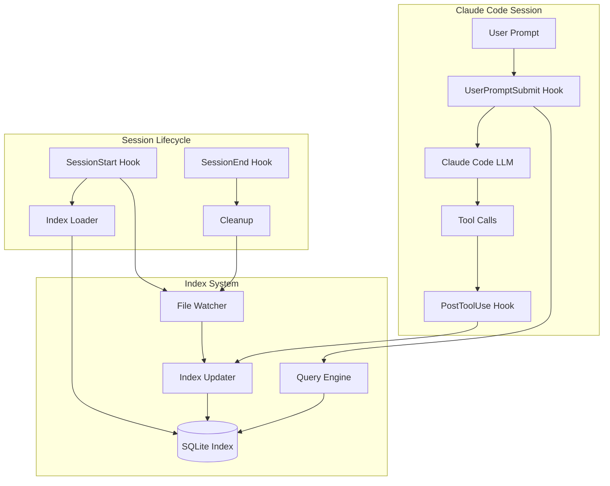
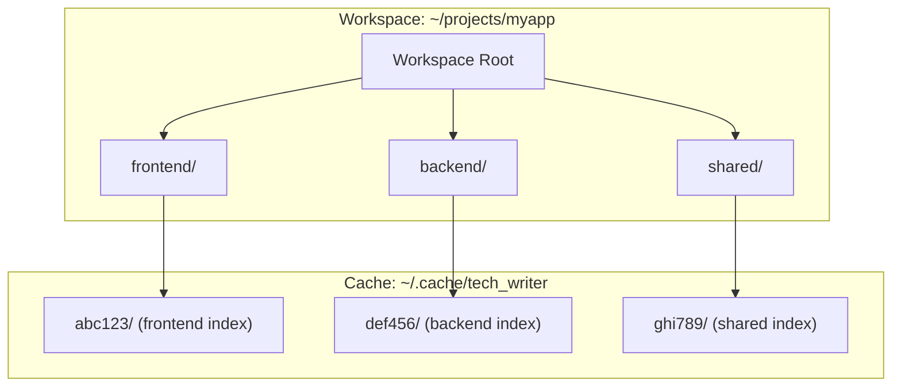
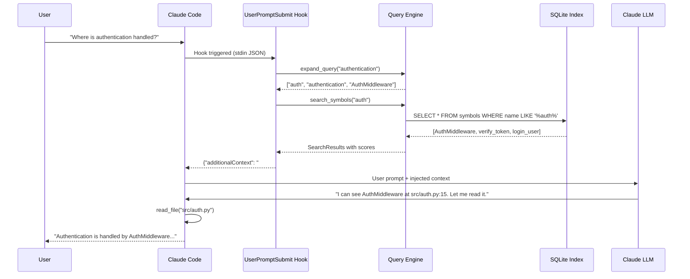
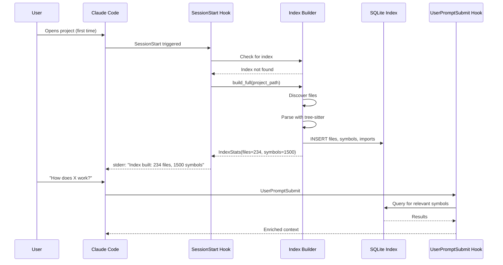
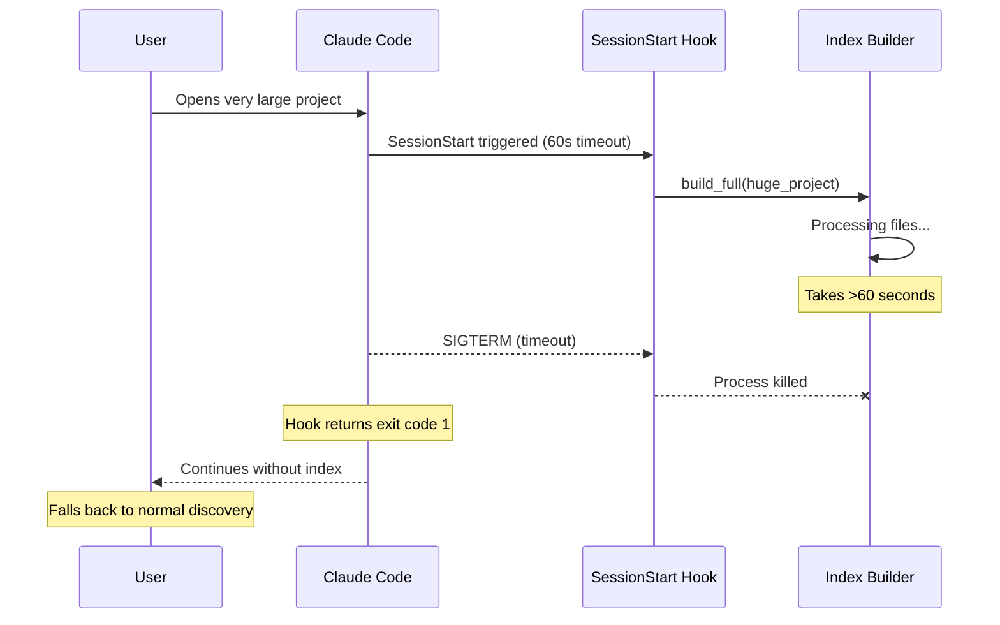
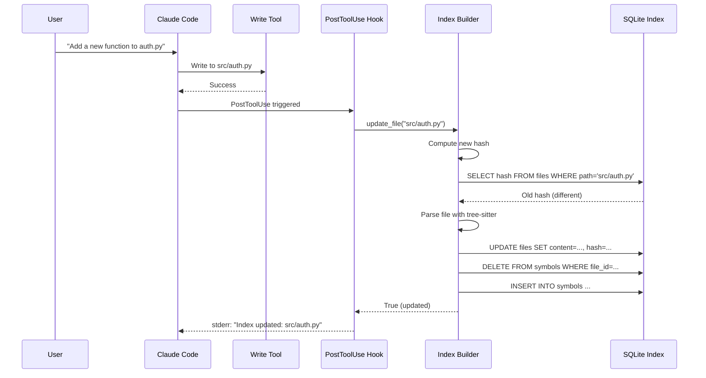

# Feature 4: Claude Code Prompt Enrichment - Technical Design

## 1. Overview

This feature implements a Claude Code hook-based system that enriches user prompts with pre-indexed code context, reducing LLM discovery calls by 80-90%.

### 1.1 Architecture Summary



### 1.2 Component Responsibilities

| Component | Responsibility |
|-----------|---------------|
| Index Builder | Parse files, extract symbols, populate SQLite |
| Query Engine | Match user prompts to relevant symbols |
| Hook Scripts | Bridge between Claude Code events and index |
| File Watcher | Detect external file changes |
| Index Updater | Incrementally update index on changes |

### 1.3 Index Storage Location

Indexes are stored in the user's cache directory, **not** in the project directory:

```
~/.cache/tech_writer/
├── a1b2c3d4e5f6g7h8/          # SHA256 hash of project path (first 16 chars)
│   ├── index.db               # SQLite database
│   ├── project_path.txt       # Breadcrumb: original project path
│   └── watcher.pid            # File watcher PID (if running)
├── i9j0k1l2m3n4o5p6/          # Another project
│   ├── index.db
│   └── project_path.txt
```

**Rationale**:
- Indexes are caches, not source artifacts - don't belong in git
- No `.gitignore` modifications required
- Persists across repository clones
- XDG-compliant cache location

### 1.4 Multi-Repository Workspace Handling

Claude Code's `cwd` may be a workspace root containing multiple git repositories. The system detects and indexes each repository separately.



**Discovery algorithm**:
1. Check if `cwd` itself is a git repository
2. Scan up to 3 levels deep for `.git` directories
3. Index each discovered repository separately
4. Query all relevant indexes and merge results

---

## 2. Data Model

### 2.1 SQLite Schema

```sql
-- Core file storage
CREATE TABLE files (
    id INTEGER PRIMARY KEY,
    path TEXT UNIQUE NOT NULL,
    content TEXT,
    lang TEXT NOT NULL,
    line_count INTEGER,
    hash TEXT NOT NULL,           -- SHA256 prefix for change detection
    indexed_at TEXT NOT NULL      -- ISO timestamp
);

-- Symbol definitions (functions, classes, methods, etc.)
CREATE TABLE symbols (
    id INTEGER PRIMARY KEY,
    file_id INTEGER NOT NULL REFERENCES files(id) ON DELETE CASCADE,
    name TEXT NOT NULL,
    kind TEXT NOT NULL,           -- 'function', 'class', 'method', 'variable'
    line INTEGER NOT NULL,
    end_line INTEGER,
    signature TEXT,               -- e.g., "def foo(x: int, y: str) -> bool"
    doc TEXT,                     -- Docstring/comment
    parent_id INTEGER REFERENCES symbols(id)  -- For nested symbols
);

-- Import statements
CREATE TABLE imports (
    id INTEGER PRIMARY KEY,
    file_id INTEGER NOT NULL REFERENCES files(id) ON DELETE CASCADE,
    line INTEGER NOT NULL,
    imported_name TEXT NOT NULL,  -- What's being imported
    imported_from TEXT,           -- Module/file path (NULL for bare imports)
    alias TEXT                    -- Import alias if any
);

-- Full-text search on content
CREATE VIRTUAL TABLE files_fts USING fts5(
    path,
    content,
    content=files,
    content_rowid=id
);

-- Indexes for fast lookup
CREATE INDEX idx_symbols_name ON symbols(name);
CREATE INDEX idx_symbols_kind ON symbols(kind);
CREATE INDEX idx_symbols_file ON symbols(file_id);
CREATE INDEX idx_imports_name ON imports(imported_name);
CREATE INDEX idx_imports_from ON imports(imported_from);
CREATE INDEX idx_files_hash ON files(hash);
```

### 2.2 Python Types

```python
# tech_writer/index/types.py

from dataclasses import dataclass
from enum import Enum
from typing import Optional
from datetime import datetime


class SymbolKind(Enum):
    """Types of symbols that can be indexed."""
    FUNCTION = "function"
    CLASS = "class"
    METHOD = "method"
    VARIABLE = "variable"
    CONSTANT = "constant"
    INTERFACE = "interface"
    MODULE = "module"


@dataclass(frozen=True)
class FileInfo:
    """Metadata about an indexed file."""
    id: int
    path: str
    lang: str
    line_count: int
    hash: str
    indexed_at: datetime


@dataclass(frozen=True)
class Symbol:
    """A code symbol (function, class, etc.)."""
    id: int
    file_id: int
    name: str
    kind: SymbolKind
    line: int
    end_line: Optional[int]
    signature: Optional[str]
    doc: Optional[str]
    parent_id: Optional[int]


@dataclass(frozen=True)
class Import:
    """An import statement."""
    id: int
    file_id: int
    line: int
    imported_name: str
    imported_from: Optional[str]
    alias: Optional[str]


@dataclass(frozen=True)
class SearchResult:
    """A search result with relevance score."""
    symbol: Symbol
    file_path: str
    score: float
    context: str  # Surrounding code snippet


@dataclass
class IndexStats:
    """Statistics about the index."""
    total_files: int
    total_symbols: int
    total_imports: int
    languages: dict[str, int]  # lang -> file count
    last_updated: datetime
```

---

## 3. Component Design

### 3.1 Index Builder

#### 3.1.1 Module Structure

```
tech_writer/index/
├── __init__.py
├── types.py          # Dataclasses defined above
├── paths.py          # Index path resolution and multi-repo discovery
├── schema.py         # SQL schema and migrations
├── builder.py        # Index construction
├── parser.py         # Tree-sitter parsing
├── queries.py        # Language-specific tree-sitter queries
├── updater.py        # Incremental updates
├── search.py         # Query engine
└── watcher.py        # File system monitoring
```

#### 3.1.2 Path Resolution

```python
# tech_writer/index/paths.py

# Constants
CACHE_BASE: Path  # ~/.cache/tech_writer
MAX_GIT_SEARCH_DEPTH: int = 3

# Functions
def get_cache_dir() -> Path:
    """Get the base cache directory, creating if needed."""

def get_index_dir(project_root: Path) -> Path:
    """
    Get the index directory for a project.

    Creates ~/.cache/tech_writer/<hash>/ where hash is SHA256(project_path)[:16].
    Writes project_path.txt breadcrumb on first access.
    """

def get_index_db_path(project_root: Path) -> Path:
    """Get the SQLite database path for a project."""

def get_watcher_pid_path(project_root: Path) -> Path:
    """Get the watcher PID file path for a project."""

def discover_repos(workspace_root: Path) -> list[Path]:
    """
    Discover git repositories under a workspace root.

    Algorithm:
    1. Check if workspace_root itself has .git
    2. Glob for .git up to MAX_GIT_SEARCH_DEPTH levels
    3. Filter out nested repos (repos inside other repos)
    4. Fallback to [workspace_root] if no repos found
    """

def get_all_index_paths(workspace_root: Path) -> list[Path]:
    """Get all index.db paths for all repos in workspace."""

def cleanup_stale_indexes(max_age_days: int = 30) -> int:
    """
    Remove indexes for projects that no longer exist or are stale.

    Removes if:
    - project_path.txt points to non-existent directory
    - index.db not modified in max_age_days
    """
```

#### 3.1.2 Builder Interface

```python
# tech_writer/index/builder.py

from pathlib import Path
from typing import Iterator, Optional
import sqlite3

from .types import FileInfo, Symbol, Import, IndexStats


class IndexBuilder:
    """Builds and maintains the code index."""

    # Supported file extensions by language
    LANGUAGE_EXTENSIONS: dict[str, list[str]] = {
        "python": [".py", ".pyi"],
        "javascript": [".js", ".jsx", ".mjs"],
        "typescript": [".ts", ".tsx"],
        "go": [".go"],
        "rust": [".rs"],
        "ruby": [".rb"],
        "java": [".java"],
        "php": [".php"],
        "cpp": [".cpp", ".cc", ".cxx", ".hpp", ".h"],
    }

    # Directories to skip
    SKIP_DIRS: set[str] = {
        "node_modules", ".git", "__pycache__", ".venv",
        "venv", "dist", "build", ".next", "target"
    }

    def __init__(self, db_path: Path):
        """Initialize builder with database path."""
        ...

    def build_full(self, repo_path: Path) -> IndexStats:
        """
        Build complete index for a repository.

        Args:
            repo_path: Root directory to index

        Returns:
            Statistics about the built index
        """
        ...

    def update_file(self, file_path: Path) -> bool:
        """
        Update index for a single file.

        Args:
            file_path: Path to the changed file

        Returns:
            True if file was updated, False if unchanged
        """
        ...

    def remove_file(self, file_path: Path) -> bool:
        """
        Remove a file from the index.

        Args:
            file_path: Path to the deleted file

        Returns:
            True if file was removed, False if not found
        """
        ...

    def get_stats(self) -> IndexStats:
        """Get current index statistics."""
        ...

    def _discover_files(self, repo_path: Path) -> Iterator[Path]:
        """Yield all indexable files in repository."""
        ...

    def _compute_hash(self, content: str) -> str:
        """Compute content hash for change detection."""
        ...

    def _detect_language(self, path: Path) -> Optional[str]:
        """Detect language from file extension."""
        ...
```

#### 3.1.3 Parser Interface

```python
# tech_writer/index/parser.py

from pathlib import Path
from typing import Iterator

from .types import Symbol, Import


class CodeParser:
    """Parses source files using tree-sitter."""

    def __init__(self):
        """Initialize parser with language grammars."""
        ...

    def parse_file(self, path: Path, content: str, lang: str) -> tuple[list[Symbol], list[Import]]:
        """
        Parse a file and extract symbols and imports.

        Args:
            path: File path (for error reporting)
            content: File content
            lang: Language identifier

        Returns:
            Tuple of (symbols, imports)
        """
        ...

    def _load_grammar(self, lang: str) -> None:
        """Load tree-sitter grammar for language."""
        ...

    def _run_query(self, tree, query: str) -> Iterator[dict]:
        """Run tree-sitter query and yield captures."""
        ...
```

### 3.2 Query Engine

#### 3.2.1 Search Interface

```python
# tech_writer/index/search.py

from pathlib import Path
from typing import Optional

from .types import SearchResult, Symbol


# Maximum results to return per query
MAX_RESULTS = 15

# Maximum context lines around a symbol
CONTEXT_LINES = 3


class QueryEngine:
    """Searches the code index."""

    def __init__(self, db_path: Path):
        """Initialize with database path."""
        ...

    def search_symbols(
        self,
        query: str,
        kinds: Optional[list[str]] = None,
        limit: int = MAX_RESULTS
    ) -> list[SearchResult]:
        """
        Search for symbols matching query.

        Args:
            query: Search terms (supports wildcards)
            kinds: Filter by symbol kinds (e.g., ['function', 'class'])
            limit: Maximum results

        Returns:
            List of search results with scores
        """
        ...

    def search_content(
        self,
        query: str,
        limit: int = MAX_RESULTS
    ) -> list[SearchResult]:
        """
        Full-text search in file content.

        Args:
            query: FTS5 query string
            limit: Maximum results

        Returns:
            List of search results
        """
        ...

    def find_definition(self, name: str) -> Optional[Symbol]:
        """
        Find the definition of a symbol by exact name.

        Args:
            name: Symbol name to find

        Returns:
            Symbol if found, None otherwise
        """
        ...

    def find_importers(self, module_path: str) -> list[str]:
        """
        Find all files that import a given module.

        Args:
            module_path: Module path to search for

        Returns:
            List of file paths that import this module
        """
        ...

    def get_file_symbols(self, file_path: str) -> list[Symbol]:
        """
        Get all symbols defined in a file.

        Args:
            file_path: Path to the file

        Returns:
            List of symbols in the file
        """
        ...

    def expand_query(self, natural_query: str) -> list[str]:
        """
        Expand natural language query to code search terms.

        Extracts:
        - CamelCase identifiers
        - snake_case identifiers
        - Quoted strings
        - Backtick code references

        Args:
            natural_query: User's natural language query

        Returns:
            List of extracted search terms
        """
        ...
```

### 3.3 Hook Scripts

#### 3.3.1 Hook Configuration

```json
// .claude/settings.json
{
  "hooks": {
    "SessionStart": [{
      "hooks": [{
        "type": "command",
        "command": "python -m tech_writer.hooks.session_start",
        "timeout": 30
      }]
    }],
    "PostToolUse": [{
      "matcher": "Write|Edit",
      "hooks": [{
        "type": "command",
        "command": "python -m tech_writer.hooks.post_tool_use"
      }]
    }],
    "UserPromptSubmit": [{
      "hooks": [{
        "type": "command",
        "command": "python -m tech_writer.hooks.user_prompt_submit"
      }]
    }],
    "SessionEnd": [{
      "hooks": [{
        "type": "command",
        "command": "python -m tech_writer.hooks.session_end"
      }]
    }]
  }
}
```

#### 3.3.2 Hook Module Structure

```
tech_writer/hooks/
├── __init__.py
├── session_start.py    # Initialize index, start watcher
├── post_tool_use.py    # Update index on file changes
├── user_prompt_submit.py  # Inject context into prompt
├── session_end.py      # Cleanup watcher
└── common.py           # Shared utilities
```

#### 3.3.3 SessionStart Hook

```python
# tech_writer/hooks/session_start.py

"""
SessionStart hook: Initialize index and file watcher.

Input (stdin JSON):
{
    "session_id": "...",
    "hook_event_name": "SessionStart",
    "cwd": "/path/to/workspace"
}

Output: None (stderr for logging)
Exit codes: 0=success, 1=warning, 2=block
"""

def main() -> int:
    """
    Main hook entry point.

    Algorithm:
    1. Parse cwd from stdin JSON
    2. discover_repos(cwd) to find all git repos
    3. For each repo:
       a. get_index_db_path(repo) for cache location
       b. If index exists, load stats
       c. Else build_full(repo)
       d. start_watcher(repo, db_path)
       e. Write PID to get_watcher_pid_path(repo)
    4. Log totals to stderr
    """
```

#### 3.3.4 UserPromptSubmit Hook

```python
# tech_writer/hooks/user_prompt_submit.py

"""
UserPromptSubmit hook: Inject relevant code context into prompt.

Input (stdin JSON):
{
    "session_id": "...",
    "hook_event_name": "UserPromptSubmit",
    "user_prompt": "How does authentication work?",
    "cwd": "/path/to/workspace"
}

Output (stdout JSON):
{
    "additionalContext": "## Pre-indexed Code\n..."
}

Exit codes: 0=success (with or without context)
"""

# Constants
MAX_CONTEXT_CHARS: int = 2000
MAX_SEARCH_TERMS: int = 5
RESULTS_PER_INDEX: int = 10

def main() -> int:
    """
    Main hook entry point.

    Algorithm:
    1. Parse user_prompt and cwd from stdin JSON
    2. get_all_index_paths(cwd) to find all indexes
    3. Filter to existing indexes only
    4. expand_query(user_prompt) to extract search terms
    5. For each index, search_symbols() for each term
    6. Merge results, deduplicate by (file_path, symbol.name)
    7. Sort by score descending
    8. Format top results up to MAX_CONTEXT_CHARS
    9. Output {"additionalContext": ...} to stdout
    """

def format_result(result: SearchResult) -> str:
    """
    Format a search result for context injection.

    Output format:
    - {kind} `{name}` [{file_path}:{line}]
      `{signature}`
      {doc_preview}
    """
```

#### 3.3.5 PostToolUse Hook

```python
# tech_writer/hooks/post_tool_use.py

"""
PostToolUse hook: Update index when files are modified.

Input (stdin JSON):
{
    "session_id": "...",
    "hook_event_name": "PostToolUse",
    "tool_name": "Write",
    "tool_input": {"file_path": "/path/to/file.py", "content": "..."},
    "cwd": "/path/to/workspace"
}

Exit codes: 0=success
"""

def find_repo_for_file(file_path: Path, workspace_dir: Path) -> Path | None:
    """Find which repo a file belongs to by checking relative_to()."""

def main() -> int:
    """
    Main hook entry point.

    Algorithm:
    1. Parse tool_name, tool_input, cwd from stdin JSON
    2. If tool_name not in ("Write", "Edit"), return 0
    3. Extract file_path from tool_input
    4. find_repo_for_file() to determine which repo
    5. get_index_db_path(repo) for cache location
    6. If file exists: builder.update_file()
    7. If file deleted: builder.remove_file()
    8. Log to stderr
    """
```

### 3.4 File Watcher

```python
# tech_writer/index/watcher.py

"""File system watcher for external changes using watchdog library."""

# Constants
DEBOUNCE_INTERVAL: float = 0.5  # seconds


class IndexUpdateHandler(FileSystemEventHandler):
    """
    Handles file system events and updates the index.

    Attributes:
        project_root: Path - Directory being watched
        builder: IndexBuilder - For updating the index
        debounce: dict[str, float] - Last update time per path
    """

    def on_modified(self, event: FileModifiedEvent) -> None:
        """Handle file modification (debounced)."""

    def on_created(self, event) -> None:
        """Handle file creation (debounced)."""

    def on_deleted(self, event) -> None:
        """Handle file deletion."""

    def _handle_change(self, abs_path: str) -> None:
        """
        Process file change with debouncing.

        Algorithm:
        1. Check debounce dict, skip if < DEBOUNCE_INTERVAL
        2. Update debounce timestamp
        3. If _should_index(path), call builder.update_file()
        """

    def _should_index(self, path: Path) -> bool:
        """Check if file should be indexed (not hidden, not in SKIP_DIRS, valid extension)."""


def start_watcher(project_root: Path, db_path: Path) -> Optional[int]:
    """
    Start file watcher as a background process.

    Spawns: python -m tech_writer.index.watcher <project_root> <db_path>
    Returns: PID of spawned process
    """

def stop_watcher(pid_file: Path) -> bool:
    """
    Stop file watcher by PID file.

    Sends SIGTERM to process, removes PID file.
    """

def main() -> None:
    """
    Main entry point for watcher process.

    Usage: python -m tech_writer.index.watcher <project_root> <db_path>

    Creates IndexUpdateHandler and Observer, runs until SIGTERM/SIGINT.
    """
```

---

## 4. Tree-sitter Queries

### 4.1 Query File Organization

```
tech_writer/index/queries/
├── python.scm
├── javascript.scm
├── typescript.scm
├── go.scm
├── rust.scm
├── ruby.scm
├── java.scm
├── php.scm
└── cpp.scm
```

### 4.2 Python Queries

```scheme
; tech_writer/index/queries/python.scm

; Function definitions
(function_definition
  name: (identifier) @name
  parameters: (parameters) @params
) @definition.function

; Class definitions
(class_definition
  name: (identifier) @name
) @definition.class

; Method definitions (inside class)
(class_definition
  body: (block
    (function_definition
      name: (identifier) @name
      parameters: (parameters) @params
    ) @definition.method
  )
)

; Variable assignments at module level
(module
  (expression_statement
    (assignment
      left: (identifier) @name
    )
  ) @definition.variable
)

; Import statements
(import_statement
  name: (dotted_name) @import.module
) @import

(import_from_statement
  module_name: (dotted_name) @import.from
  name: (dotted_name (identifier) @import.name)
) @import

; Aliased imports
(import_from_statement
  module_name: (dotted_name) @import.from
  name: (aliased_import
    name: (dotted_name (identifier) @import.name)
    alias: (identifier) @import.alias
  )
) @import
```

### 4.3 JavaScript/TypeScript Queries

```scheme
; tech_writer/index/queries/javascript.scm

; Function declarations
(function_declaration
  name: (identifier) @name
) @definition.function

; Arrow functions assigned to variables
(variable_declarator
  name: (identifier) @name
  value: (arrow_function)
) @definition.function

; Class declarations
(class_declaration
  name: (identifier) @name
) @definition.class

; Method definitions
(method_definition
  name: (property_identifier) @name
) @definition.method

; Import statements
(import_statement
  source: (string) @import.from
) @import

(import_clause
  (named_imports
    (import_specifier
      name: (identifier) @import.name
      alias: (identifier)? @import.alias
    )
  )
)

; Default imports
(import_clause
  (identifier) @import.name
)

; Export statements
(export_statement
  declaration: (function_declaration
    name: (identifier) @name
  )
) @definition.function.exported
```

---

## 5. Sequence Diagrams

### 5.1 Golden Path: User Query with Index Hit



### 5.2 Alternate Path: No Index Exists



### 5.3 Error Path: Hook Timeout



### 5.4 Incremental Update Path



---

## 6. Testing Strategy

### 6.1 Unit Tests

#### 6.1.1 Builder Tests (`tests/tech_writer/index/test_builder.py`)

| Test | Description |
|------|-------------|
| `test_detect_language_python` | `.py` and `.pyi` → "python" |
| `test_detect_language_unknown` | `.xyz` → None |
| `test_compute_hash_deterministic` | Same content → same hash |
| `test_compute_hash_different` | Different content → different hash |
| `test_skip_dirs_excluded` | node_modules, .git not discovered |
| `test_build_full_populates_tables` | Files, symbols, imports tables populated |
| `test_update_file_detects_changes` | Changed hash triggers re-parse |
| `test_remove_file_cascades` | Symbols deleted with file |

#### 6.1.2 Parser Tests (`tests/tech_writer/index/test_parser.py`)

| Test | Description |
|------|-------------|
| `test_parse_python_function` | Extracts name, line, signature |
| `test_parse_python_class` | Extracts class and nested methods |
| `test_parse_python_imports` | Handles import, from...import, aliases |
| `test_parse_syntax_error` | Graceful handling, returns partial |
| `test_parse_javascript_function` | Function declarations and arrow functions |
| `test_parse_javascript_imports` | ES6 imports, default and named |

#### 6.1.3 Query Engine Tests (`tests/tech_writer/index/test_search.py`)

| Test | Description |
|------|-------------|
| `test_expand_query_camel_case` | "UserService" extracted |
| `test_expand_query_snake_case` | "get_user_by_id" extracted |
| `test_expand_query_backticks` | `` `authenticate` `` extracted |
| `test_search_symbols_by_name` | LIKE match, returns scores |
| `test_search_symbols_by_kind` | Filter by function/class/method |
| `test_search_content_fts5` | Full-text search works |
| `test_find_definition_exact` | Exact name match |
| `test_find_importers` | Finds files importing module |

#### 6.1.4 Paths Tests (`tests/tech_writer/index/test_paths.py`)

| Test | Description |
|------|-------------|
| `test_get_index_dir_creates_cache` | Creates ~/.cache/tech_writer/<hash>/ |
| `test_get_index_dir_writes_breadcrumb` | project_path.txt written |
| `test_discover_repos_single` | Single git repo detected |
| `test_discover_repos_nested` | Multiple nested repos detected |
| `test_discover_repos_fallback` | No .git → returns workspace root |
| `test_cleanup_stale_indexes` | Removes orphaned/old indexes |

### 6.2 Integration Tests

#### 6.2.1 Index Integration (`tests/tech_writer/index/test_integration.py`)

**Fixture**: `sample_project` - Creates tmp_path with:
- `src/auth.py`: AuthService class with login/logout methods
- `src/api.py`: Imports AuthService, has handle_login function

| Test | Description |
|------|-------------|
| `test_full_index_build` | Builds index, verifies file and symbol counts |
| `test_incremental_update` | Modify file → update_file() → new symbol found |
| `test_import_tracking` | find_importers() returns dependent files |
| `test_multi_repo_workspace` | Multiple repos indexed separately |
| `test_cache_location` | Index stored in ~/.cache/tech_writer/<hash>/ |

### 6.3 BDD Feature Tests (`tests/features/test_prompt_enrichment_bdd.py`)

```gherkin
Feature: Claude Code Prompt Enrichment
  As a developer using Claude Code
  I want my prompts enriched with relevant code context
  So that I get faster, more accurate responses
```

| Scenario | Given | When | Then |
|----------|-------|------|------|
| Symbol injection on query | Indexed project with AuthService | User asks "How does authentication work?" | Hook injects AuthService location |
| No injection when no matches | Indexed project | User asks "What's the weather?" | No additionalContext in output |
| Index updates on file write | Indexed project | File modified via Write tool | New symbol searchable |
| Multi-repo query merging | Workspace with 2 repos indexed | User asks about symbol in both | Results from both repos merged |
| Session lifecycle | Fresh workspace | SessionStart → queries → SessionEnd | Index built, queries work, watchers stopped |
| Graceful degradation | No index exists | UserPromptSubmit triggered | Returns 0, no injection |

---

## 7. Configuration

### 7.1 Installation Script

```bash
#!/bin/bash
# install_hooks.sh - Install Claude Code hooks for prompt enrichment

set -e

SCRIPT_DIR="$(cd "$(dirname "${BASH_SOURCE[0]}")" && pwd)"
PROJECT_ROOT="$(pwd)"
CLAUDE_DIR="$PROJECT_ROOT/.claude"

echo "Installing Claude Code prompt enrichment hooks..."

# Create .claude directory
mkdir -p "$CLAUDE_DIR"

# Write settings.json
cat > "$CLAUDE_DIR/settings.json" << 'EOF'
{
  "hooks": {
    "SessionStart": [{
      "hooks": [{
        "type": "command",
        "command": "python -m tech_writer.hooks.session_start",
        "timeout": 60
      }]
    }],
    "PostToolUse": [{
      "matcher": "Write|Edit",
      "hooks": [{
        "type": "command",
        "command": "python -m tech_writer.hooks.post_tool_use"
      }]
    }],
    "UserPromptSubmit": [{
      "hooks": [{
        "type": "command",
        "command": "python -m tech_writer.hooks.user_prompt_submit"
      }]
    }],
    "SessionEnd": [{
      "hooks": [{
        "type": "command",
        "command": "python -m tech_writer.hooks.session_end"
      }]
    }]
  }
}
EOF

echo "Hooks installed to $CLAUDE_DIR/settings.json"
echo "Start a new Claude Code session to activate."
```

### 7.2 Environment Variables

| Variable | Description | Default |
|----------|-------------|---------|
| `TECH_WRITER_CACHE_DIR` | Override cache directory | `~/.cache/tech_writer` |
| `TECH_WRITER_MAX_FILES` | Maximum files to index per repo | `10000` |
| `TECH_WRITER_SKIP_WATCHER` | Disable file watcher | `false` |
| `TECH_WRITER_DEBUG` | Enable debug logging | `false` |

### 7.3 Cache Management

**Location**: `~/.cache/tech_writer/`

**List indexed projects**:
```bash
for dir in ~/.cache/tech_writer/*/; do
    if [ -f "$dir/project_path.txt" ]; then
        echo "$(cat "$dir/project_path.txt")"
    fi
done
```

**Clear all indexes**:
```bash
rm -rf ~/.cache/tech_writer/*
```

**Cleanup stale indexes** (projects that no longer exist):
```bash
python -m tech_writer.index.paths --cleanup
```

---

## 8. Performance Considerations

### 8.1 Index Build Time

| Project Size | Files | Expected Build Time |
|--------------|-------|---------------------|
| Small | <100 | <5 seconds |
| Medium | 100-1000 | 5-30 seconds |
| Large | 1000-10000 | 30-120 seconds |
| Very Large | >10000 | May exceed hook timeout |

### 8.2 Mitigations for Large Projects

1. **Incremental first build**: Index only changed files since last session
2. **Background indexing**: Start watcher immediately, build index in background
3. **Lazy symbol parsing**: Parse files on first query, not at startup
4. **File limit**: Cap at `TECH_WRITER_MAX_FILES`, index most recently modified

### 8.3 Memory Usage

| Component | Estimated Memory |
|-----------|------------------|
| SQLite connection | ~10 MB |
| Tree-sitter parser | ~50 MB (per language loaded) |
| File watcher | ~5 MB |
| **Total** | ~100-200 MB |

---

## 9. Limitations

### 9.1 Known Limitations

| Limitation | Impact | Workaround |
|------------|--------|------------|
| No cross-file reference resolution | Can't find "all usages of X" | Import graph provides partial coverage |
| No type inference | Can't distinguish overloaded methods | Symbol signature helps disambiguation |
| Hook timeout (60s) | Large projects may fail initial build | Incremental/background indexing |
| Dynamic code | Metaprogramming not captured | FTS search as fallback |

### 9.2 Language-Specific Limitations

| Language | Limitation |
|----------|------------|
| Python | Dynamic imports (`__import__`) not tracked |
| JavaScript | CommonJS `require()` with variables not resolved |
| TypeScript | Type-only imports may be missed |
| Ruby | Metaprogramming (`define_method`) not captured |

---

## 10. Future Enhancements

1. **Cross-file references**: Add reference tracking via import resolution
2. **Call graph**: Track function call relationships
3. **Semantic search**: Embed symbols for similarity queries
4. **Multi-repo support**: Index across related repositories
5. **LSP integration**: On-demand LSP queries for precise type info
