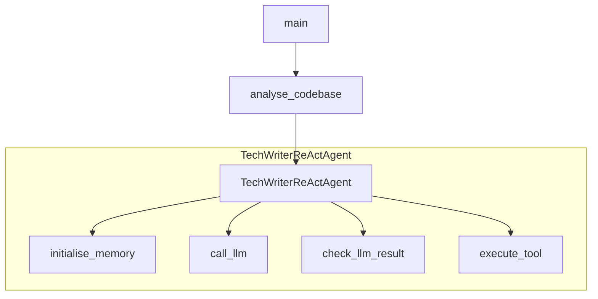
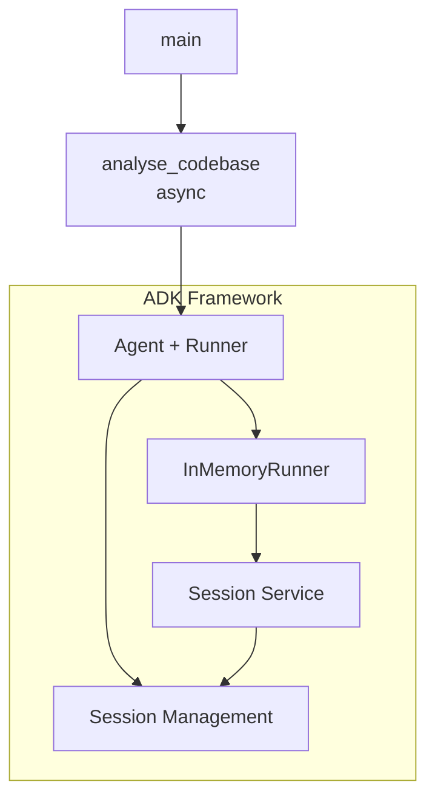
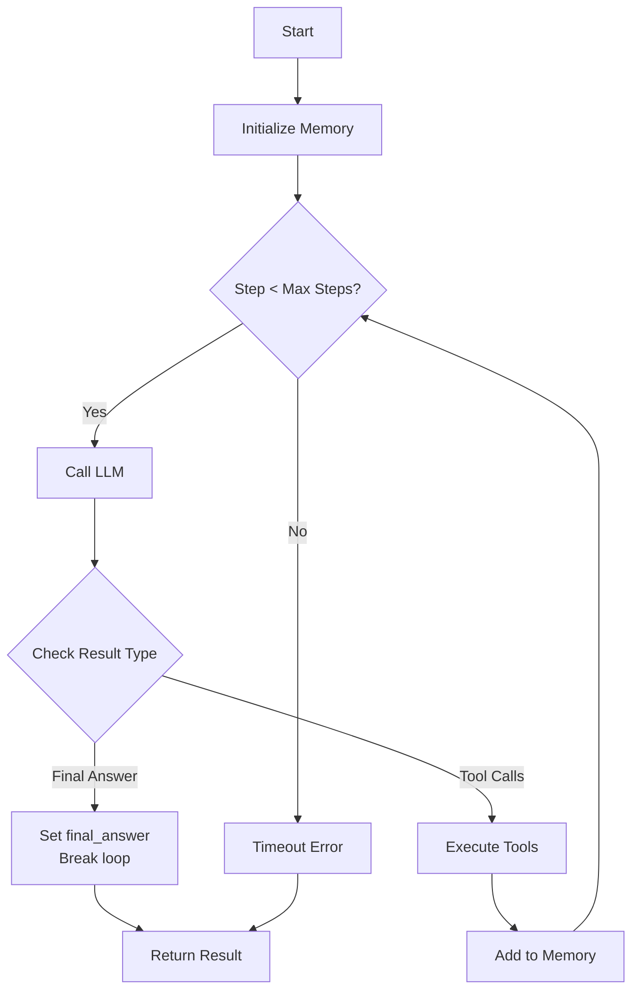
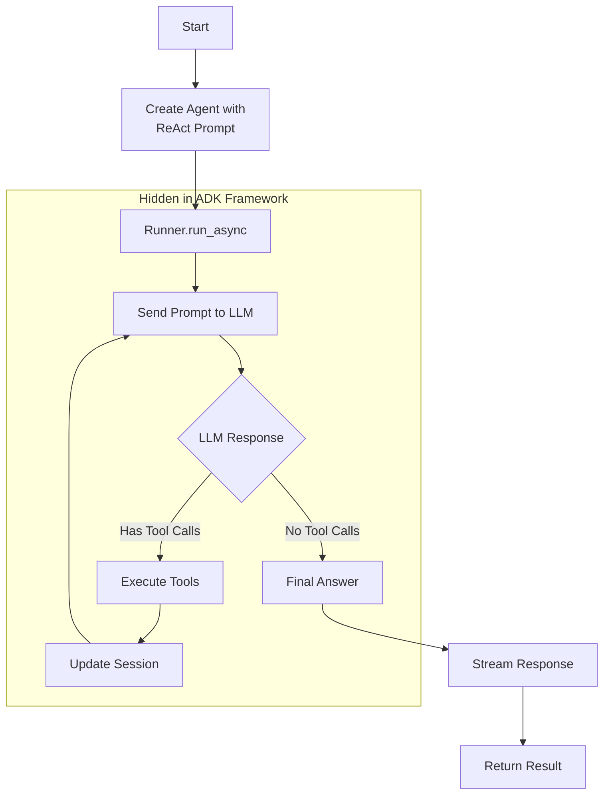

# Tech Writer Agent Implementation Comparison

## Executive Summary

This report provides an in-depth analysis of two implementations of the Tech Writer agent:
1. **Baseline Implementation** (`baremetal/python/tech-writer.py`) - Custom ReAct agent using OpenAI client
2. **ADK Implementation** (`oss-agent-makers/adk-python/tech-writer.py`) - Google Agent Development Kit port

Both implementations achieve the same goal but differ significantly in architecture, complexity, and capabilities.

## Comparison Overview

| Aspect | Baseline Implementation | ADK Implementation |
|--------|------------------------|-------------------|
| **Pros** | • Full control over agent behavior<br>• Direct memory management<br>• Transparent tool execution<br>• Minimal dependencies<br>• Synchronous, easier to debug<br>• Custom error handling | • Less code to maintain (126 vs 308 lines)<br>• Built-in session management<br>• Automatic memory handling<br>• Framework handles tool orchestration<br>• Streaming responses<br>• Future-proof with ADK updates |
| **Cons** | • More boilerplate code<br>• Manual memory management<br>• Must handle tool calling protocol<br>• Limited to OpenAI tool format<br>• No built-in persistence options | • Framework lock-in<br>• Less control over execution<br>• Async complexity<br>• Requires understanding ADK concepts<br>• Limited to ADK-supported models<br>• Harder to debug framework internals |
| **Lines of Code** | 308 | 126 |
| **Dependencies** | OpenAI client, custom utilities | Google ADK, LiteLLM for OpenAI models |
| **Execution Model** | Synchronous | Asynchronous |
| **Memory Management** | Manual list of messages | Automatic via sessions |
| **Tool Calling** | Manual OpenAI protocol | Automatic ADK handling |
| **Error Handling** | Custom exceptions | Framework + custom exceptions |

## Architecture Analysis

### Baseline Implementation Architecture



**Key Components:**
- `TechWriterReActAgent` class encapsulates all agent logic
- Manual memory management with `self.memory` list
- Direct OpenAI client usage with explicit API calls
- Custom tool execution with JSON encoding/decoding

### ADK Implementation Architecture



**Key Components:**
- Declarative `Agent` configuration
- `InMemoryRunner` handles execution
- Automatic session and memory management
- Framework handles tool calling protocol

## Code Complexity Analysis

### Baseline Implementation (308 lines)

**Complexity Breakdown:**
- Agent class definition: ~150 lines
- Memory management: ~30 lines
- Tool execution: ~40 lines
- LLM interaction: ~50 lines
- Main logic: ~38 lines

**Key Methods:**
1. `create_openai_tool_definitions()` - 40 lines of introspection logic
2. `run()` - 50 lines of ReAct loop implementation
3. `execute_tool()` - Manual tool calling with error handling

### ADK Implementation (126 lines)

**Complexity Breakdown:**
- Agent setup: ~15 lines
- Main async function: ~45 lines
- Utilities and imports: ~66 lines

**Simplifications:**
- No manual memory management
- No tool definition creation
- No explicit ReAct loop
- Framework handles error propagation

## ReAct Pattern Implementation

Both implementations use the **same ReAct prompt** (`REACT_SYSTEM_PROMPT`) that instructs the LLM to follow the Reasoning and Acting pattern. However, they differ in how the execution loop is managed:

### Baseline ReAct Implementation



**Explicit Loop Management:**
- Manual `for` loop with step counter
- Explicit checks for final answer vs tool calls
- Manual memory updates after each tool execution
- Explicit break condition when final answer received

### ADK ReAct Implementation



**Automatic Loop Management:**
- ADK internally manages the execution loop
- Framework detects tool calls vs final answers
- Session automatically maintains conversation history
- Loop terminates when LLM sends response without tool calls

### Key Insight

Both implementations achieve the same ReAct behavior through the prompt instructions. The difference is:
- **Baseline**: Explicit loop with visible state management
- **ADK**: Implicit loop with framework-managed state

The ADK approach treats "no tool calls in response" as the signal that the LLM has provided its final answer, automatically terminating the ReAct loop. This is why there's no explicit "final answer" detection in the ADK code - the framework infers it from the absence of tool calls.

## Feature Comparison

### 1. Memory Management

**Baseline:**
```python
self.memory = [{"role": "system", "content": self.system_prompt}]
self.memory.append({"role": "user", "content": f"Base directory: {directory}\n\n{prompt}"})
# Manual append for each interaction
```

**ADK:**
```python
# Automatic - session handles all memory
session = await runner.session_service.create_session(
    app_name='tech_writer',
    user_id='cli_user'
)
```

### 2. Tool Calling

**Baseline:**
```python
def execute_tool(self, tool_call):
    tool_name = tool_call.function.name
    args = json.loads(tool_call.function.arguments)
    result = TOOLS[tool_name](**args)
    return json.dumps(result, cls=CustomEncoder, indent=2)
```

**ADK:**
```python
# Just pass tools to Agent, framework handles everything
tools=[find_all_matching_files_json, read_file]
```

### 3. Model Support

**Baseline:**
- Direct support for OpenAI and Gemini (via OpenAI-compatible endpoint)
- Model specified by string name

**ADK:**
- Requires LiteLLM wrapper for OpenAI models
- Native support for Gemini models
- More complex model initialization

### 4. Error Handling

**Baseline:**
```python
except Exception as e:
    logger.error(f"Unexpected error in step {step + 1}: {e}", exc_info=True)
    raise RuntimeError(f"Error running code analysis: {e}") from e
```

**ADK:**
- Framework handles most errors
- Less granular control over error messages
- Async error propagation

## Performance Characteristics

### Baseline
- **Synchronous execution**: Simpler debugging, predictable flow
- **Direct API calls**: Minimal overhead
- **Memory usage**: Grows linearly with conversation length

### ADK
- **Asynchronous execution**: Better for concurrent operations
- **Framework overhead**: Additional abstraction layers
- **Streaming responses**: Better user experience for long outputs
- **Session management**: More memory but better organization

## Maintenance Considerations

### Baseline
- **Pros**: 
  - All logic visible in one file
  - Easy to modify agent behavior
  - Direct control over prompts and responses
- **Cons**: 
  - Must maintain tool calling protocol
  - Manual updates for API changes
  - More code to test

### ADK
- **Pros**: 
  - Framework handles protocol updates
  - Less code to maintain
  - Built-in features (sessions, streaming)
- **Cons**: 
  - Framework version dependencies
  - Breaking changes in ADK affect agent
  - Less flexibility for customization

## Recommendations

**Use Baseline Implementation when:**
- You need full control over agent behavior
- Debugging specific issues in the ReAct loop
- Implementing custom memory strategies
- Working with non-standard LLM providers

**Use ADK Implementation when:**
- Building production multi-user applications
- You want built-in session management
- Leveraging Google Cloud integrations
- Prioritizing maintainability over control

## Conclusion

The ADK implementation achieves the same functionality with 59% less code by leveraging the framework's built-in capabilities. However, this comes at the cost of reduced control and increased complexity in understanding the framework's abstractions. The choice between implementations depends on specific project requirements, team expertise, and long-term maintenance considerations.