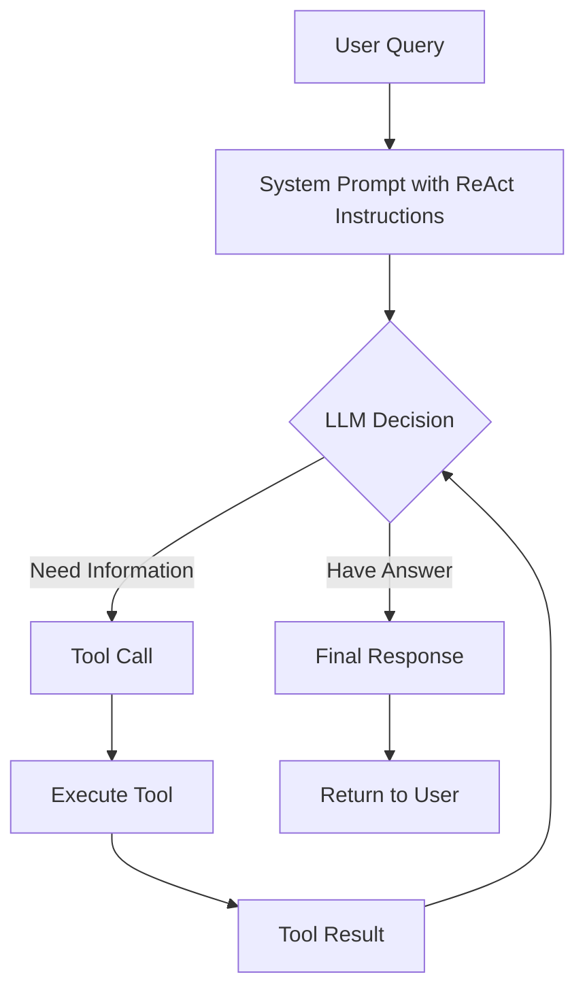
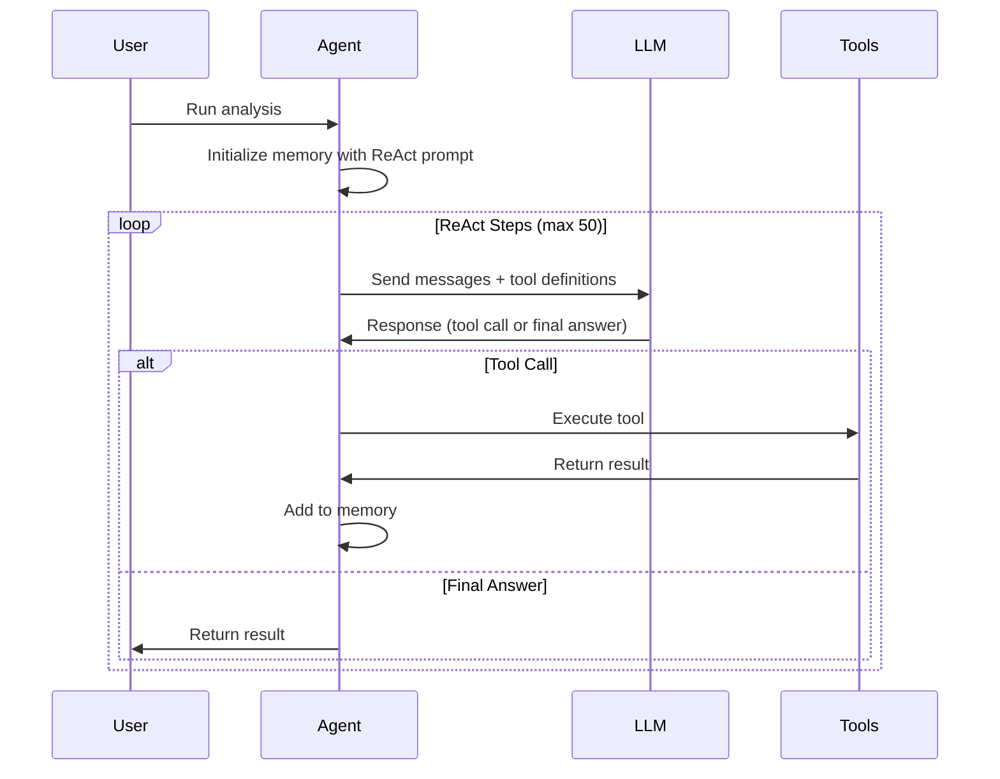
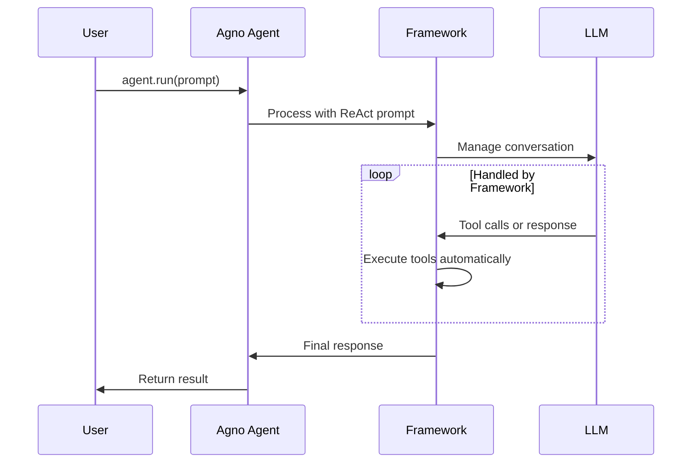

# Code Comparison Report: Baseline vs Agno Tech Writer

## Executive Summary

This report compares the baseline tech writer implementation with the Agno (phidata) port, analyzing architecture, code complexity, and framework capabilities.

### Key Metrics

| Metric | Baseline | Agno | Difference |
|--------|----------|------|------------|
| Lines of Code | 308 | 133 | -57% |
| Number of Functions | 8 | 6 | -25% |
| Dependencies | OpenAI SDK | Agno + OpenAI/Anthropic | +1 |
| Async Support | No | No | Same |
| Tool Definition Complexity | High (137 lines) | None (0 lines) | -100% |

## Pros and Cons

### Agno Implementation

**Pros:**
- Significantly less code (57% reduction)
- No manual tool definition creation required
- Built-in support for multiple LLM providers
- Automatic tool calling handling
- Built-in streaming and markdown support
- Cleaner, more maintainable code

**Cons:**
- Additional framework dependency
- Less control over tool calling mechanics
- Limited to framework's capabilities
- Model selection requires provider-specific classes

### Baseline Implementation

**Pros:**
- Direct control over all aspects
- No framework dependencies beyond OpenAI SDK
- Custom tool definition generation
- Full control over ReAct loop

**Cons:**
- Significant boilerplate code
- Manual tool definition creation (137 lines)
- Manual tool execution handling
- More complex error handling

## LLM Support

| Provider | Baseline | Agno |
|----------|----------|------|
| OpenAI | ✅ Full support | ✅ via OpenAIChat |
| Anthropic | ❌ Not supported | ✅ via Claude |
| Google Gemini | ✅ via OpenAI compatibility | ❓ Not tested |
| Custom/Local | ✅ via base_url | ❓ Framework dependent |

## Memory Management

- **Baseline**: Manual memory management with message list
- **Agno**: Automatic conversation tracking per agent instance

## Tool Calling

- **Baseline**: 
  - Manual tool definition creation from function signatures
  - Explicit tool execution and result handling
  - Full control over tool call flow
- **Agno**: 
  - Automatic tool wrapping
  - Framework handles execution
  - Simplified but less flexible

## ReAct Support

Both implementations support ReAct through the same system prompt. However:
- **Baseline**: Explicit ReAct loop with step counting
- **Agno**: Implicit handling through agent.run()

## Maintenance

- **Baseline**: Higher maintenance burden due to manual tool handling
- **Agno**: Lower maintenance, framework handles complexity

## Performance

- **Baseline**: Direct API calls, minimal overhead
- **Agno**: Small framework overhead, but negligible in practice

## Recommendations

1. **Use Agno when**:
   - You need quick implementation
   - Multi-provider support is important
   - You want built-in features like streaming
   - Code simplicity is a priority

2. **Use Baseline when**:
   - You need full control over the ReAct loop
   - You want to minimize dependencies
   - Custom tool calling behavior is required
   - You need to support unusual LLM providers

## Shared Code Analysis

Both implementations successfully share code from the `common` directory:
- ✅ Logging configuration
- ✅ Utility functions (file operations, prompts)
- ✅ Tool implementations
- ✅ ReAct system prompt

The Agno version required thin wrapper functions for JSON serialization but otherwise maximizes code reuse.

## ReAct Implementation Details

### How ReAct Works in Both Implementations

### Baseline ReAct Loop

### Agno ReAct Implementation

### Key Difference

The Agno framework **implicitly handles the ReAct loop** through its agent architecture. While both use the same ReAct prompt, Agno manages:
- Tool call detection
- Tool execution
- Result injection
- Loop continuation

This is why the Agno version appears to have "no explicit ReAct loop" - it's handled by `agent.run()` internally.

## Conclusion

The Agno implementation achieves the same functionality with 57% less code while maintaining full ReAct capabilities. The tradeoff is between code simplicity (Agno) and fine-grained control (baseline).